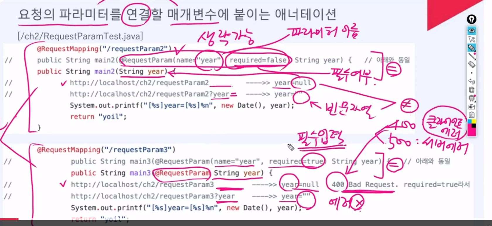

# Ch. 02 Spring MVC
## 01. 원격 프로그램의 실행
```java
package com.fastcampus.ch2;

import org.springframework.stereotype.Controller;
import org.springframework.web.bind.annotation.RequestMapping;

//1. 원격 호출 가능한 프로그램으로 등록
@Controller
public class Hello {
    int iv = 10;	// 인스턴스 변수
    static int cv = 20; // static 변수
    
    // 2. URL과 메서드 연결(매핑, Mapping)
    @RequestMapping("/hello")
    public void main() { // 인스턴스 메서드 - iv, cv 둘 다 사용 가능 : 이걸로 사용하는 것이 좋음
        // static 메서드로 사용해도 가능은 함
        // priviate로 호출해도 가능은 함
            // Reflection API를 사용해서 가능 - 클래스 정보를 얻고 다룰 수 있는 강력한 기능 제공
        System.out.println("Hello");
    }
    
    public static void main2() { // static 메서드 - cv만 사용 가능
        
    }
}
```
## 02. AWS 배포하기
* 프로젝트 우클릭 > export > war 파일로 다운로드 후 복사
* 원격 컴퓨터 > tomcat folder > webapps folder 안에 붙여넣기
* tomcat 실행
* 내 컴퓨터에서 IP를 이용해 원격 접속

## 03. HTTP 요청과 응답 - 실습

```java
package com.fastcampus.ch2;

import org.springframework.stereotype.Controller;
import org.springframework.web.bind.annotation.RequestMapping;

import javax.servlet.http.HttpServletRequest;

@Controller
public class RequestInfo {
    @RequestMapping("/requestInfo")
    //    public static void main(String[] args) {
    public void main(HttpServletRequest request) {
        System.out.println("request.getCharacterEncoding()="+request.getCharacterEncoding()); // 요청 내용의 인코딩
        System.out.println("request.getContentLength()="+request.getContentLength());  // 요청 내용의 길이. 알수 없을 때는 -1
        System.out.println("request.getContentType()="+request.getContentType()); // 요청 내용의 타입. 알 수 없을 때는 null

        System.out.println("request.getMethod()="+request.getMethod());      // 요청 방법
        System.out.println("request.getProtocol()="+request.getProtocol());  // 프로토콜의 종류와 버젼 HTTP/1.1
        System.out.println("request.getScheme()="+request.getScheme());      // 프로토콜

        System.out.println("request.getServerName()="+request.getServerName()); // 서버 이름 또는 ip주소
        System.out.println("request.getServerPort()="+request.getServerPort()); // 서버 포트
        System.out.println("request.getRequestURL()="+request.getRequestURL()); // 요청 URL
        System.out.println("request.getRequestURI()="+request.getRequestURI()); // 요청 URI

        System.out.println("request.getContextPath()="+request.getContextPath()); // context path
        System.out.println("request.getServletPath()="+request.getServletPath()); // servlet path
        System.out.println("request.getQueryString()="+request.getQueryString()); // 쿼리 스트링

        System.out.println("request.getLocalName()="+request.getLocalName()); // 로컬 이름
        System.out.println("request.getLocalPort()="+request.getLocalPort()); // 로컬 포트

        System.out.println("request.getRemoteAddr()="+request.getRemoteAddr()); // 원격 ip주소
        System.out.println("request.getRemoteHost()="+request.getRemoteHost()); // 원격 호스트 또는 ip주소
        System.out.println("request.getRemotePort()="+request.getRemotePort()); // 원격 포트
    }
}

/*
[실행결과] http://localhost:8080/ch2/requestInfo?year=2021&month=10&day=1 
request.getCharacterEncoding()=UTF-8
request.getContentLength()=-1
request.getContentType()=null
request.getMethod()=GET
request.getProtocol()=HTTP/1.1
request.getScheme()=http
request.getServerName()=localhost
request.getServerPort()=8080
request.getRequestURI()=http://localhost:8080/ch2/requestInfo
request.getRequestURI()=/ch2/requestInfo
request.getContextPath()=/ch2
request.getServletPath()=/requestInfo
request.getQueryString()=year=2021&month=10&day=1
request.getLocalName()=localhost
request.getLocalPort()=8080
request.getRemoteAddr()=0:0:0:0:0:0:0:1   <--- AWS에 배포(deploy)한 다음에 실행하면, 실제 ip주소를 확인할 수 있음.
request.getRemoteHost()=0:0:0:0:0:0:0:1   <--- AWS에 배포(deploy)한 다음에 실행하면, 실제 ip주소를 확인할 수 있음.
request.getRemotePort()=54855
*/
```


```java
package com.fastcampus.ch2;

import org.springframework.stereotype.Controller;
import org.springframework.web.bind.annotation.RequestMapping;

import javax.servlet.http.HttpServletRequest;
import javax.servlet.http.HttpServletResponse;
import java.io.IOException;
import java.io.PrintWriter;
import java.util.Calendar;

@Controller
public class YoilTeller {
    @RequestMapping("/getYoil") // http://localhost:8080/ch2/getYoil?year=2021&month=10&day=1
    //    public static void main(String[] args) {
    public void main(HttpServletRequest request, HttpServletResponse response) throws IOException {
        // 1. 입력
//        String year = args[0];
//        String month = args[1];
//        String day = args[2];
        String year = request.getParameter("year");
        String month = request.getParameter("month");
        String day = request.getParameter("day");

        int yyyy = Integer.parseInt(year);
        int mm = Integer.parseInt(month);
        int dd = Integer.parseInt(day);

        // 2. 처리
        Calendar cal = Calendar.getInstance();
        cal.set(yyyy, mm - 1, dd);

        int dayOfWeek = cal.get(Calendar.DAY_OF_WEEK);
        char yoil = " 일월화수목금토".charAt(dayOfWeek);   // 일요일:1, 월요일:2, ... 

        // 3. 출력
//        System.out.println(year + "년 " + month + "월 " + day + "일은 ");
//        System.out.println(yoil + "요일입니다.");
        response.setContentType("text/html");    // 응답의 형식을 html로 지정
        response.setCharacterEncoding("utf-8");  // 응답의 인코딩을 utf-8로 지정
        PrintWriter out = response.getWriter();  // 브라우저로의 출력 스트림(out)을 얻는다.
        out.println("<html>");
        out.println("<head>");
        out.println("</head>");
        out.println("<body>");
        out.println(year + "년 " + month + "월 " + day + "일은 ");
        out.println(yoil + "요일입니다.");
        out.println("</body>");
        out.println("</html>");
        out.close();
    }
}
```

## 04. HTTP 요청과 응답 - 예제
```java
package com.fastcampus.ch2;

import java.io.IOException;
import java.io.PrintWriter;

import javax.servlet.http.HttpServletResponse;

import org.springframework.stereotype.Controller;
import org.springframework.web.bind.annotation.RequestMapping;

@Controller // ctrl + shift + o: 자동 import
public class TwoDice {
    @RequestMapping("/rollDice")  // http://localhost:8080/ch2/rollDice
    public void main(HttpServletResponse response) throws IOException {
        
        int idx1 = (int)(Math.random() * 6) + 1;
        int idx2 = (int)(Math.random() * 6) + 1;
        
        response.setContentType("text/html");
        response.setCharacterEncoding("utf-8");
        PrintWriter out = response.getWriter();
        out.println("<html>");
        out.println("<head>");
        out.println("</head>");
        out.println("<body>");
        
        out.println("");
        out.println("");

        out.println("</body>");
        out.println("</html>");
    }
}
```
* 위와 같이 실행할 때 마다 바뀌는 것을 동적 리소스라고 하고, 사진과 같이 실행할 때마다 바뀌지는 않는 것은 정적 리소스라고 한다.
* 이미지 위치: src > main > webapp > resources > img

## 05. 클라이언트와 서버
* Server > Thread Pool > Protocol > Engine > Host > Context > Dispatcher Servlet > controller

## 06. 설정 파일 - server.xml, web.xml
* ```톰캣설치경로/conf/server.xml```: Tomcat 서버 설정 파일
* ```톰캣설치경로/conf/web.xml```: Tomcat의 모든 web app의 공통 설정
* ```웹앱이름/WEB-INF/web.xml```: web app의 개별 설정

## 07. HTTP 요청과 응답 - 이론

## 08. 텍스트와 바이너리, MIME, Base64
* MIME: 데이터의 타입을 명시


### RequestHeader.java
```java
package com.fastcampus.ch2;

import java.util.Enumeration;

import javax.servlet.http.HttpServletRequest;

import org.springframework.stereotype.Controller;
import org.springframework.web.bind.annotation.RequestMapping;

@Controller
public class RequestHeader {
    @RequestMapping("/requestHeader")
    public void main(HttpServletRequest request) {
        
        Enumeration<String> e = request.getHeaderNames();

        while (e.hasMoreElements()) {
            String name = e.nextElement();
            System.out.println(name + ":" + request.getHeader(name));
        }
    }
}

/*
[실행결과]
host:localhost:8080
connection:keep-alive
sec-ch-ua:"Not_A Brand";v="8", "Chromium";v="120", "Google Chrome";v="120"
sec-ch-ua-mobile:?0
sec-ch-ua-platform:"Windows"
upgrade-insecure-requests:1
user-agent:Mozilla/5.0 (Windows NT 10.0; Win64; x64) AppleWebKit/537.36 (KHTML, like Gecko) Chrome/120.0.0.0 Safari/537.36
accept:text/html,application/xhtml+xml,application/xml;q=0.9,image/avif,image/webp,image/apng,/*//*;q=0.8,application/signed-exchange;v=b3;q=0.7
sec-fetch-site:none
sec-fetch-mode:navigate
sec-fetch-user:?1
sec-fetch-dest:document
accept-encoding:gzip, deflate, br
accept-language:en-US,en;q=0.9
*/
```
### RequestMessage.java

```java
package com.fastcampus.ch2;

import java.io.IOException;
import java.io.InputStream;
import java.util.Enumeration;
import javax.servlet.http.HttpServletRequest;
import org.springframework.stereotype.Controller;
import org.springframework.web.bind.annotation.RequestMapping;

@Controller
public class RequestMessage {
    @RequestMapping("/requestMessage")
    public void main(HttpServletRequest request) throws Exception {
        
        // 1. request line
        String requestLine = request.getMethod();       // GET 또는 POST
        requestLine += " " + request.getRequestURI();   // /ch2/requestMessage
        
        String queryString = request.getQueryString();  // year=2021&month=10&day=1
        requestLine += queryString == null ? "" : "?"+queryString;  
        requestLine += " " + request.getProtocol();     // HTTP/1.1
        System.out.println(requestLine);		

        
        // 2. request headers
        Enumeration<String> e = request.getHeaderNames();

        while (e.hasMoreElements()) {
            String name = e.nextElement();
            System.out.println(name + ":" + request.getHeader(name));
        }
        
        // 3. request body - POST일 때만 해당, GET은 body가 없음(CONTENT_LENGTH=0)
        final int CONTENT_LENGTH = request.getContentLength();
//		System.out.println("content length="+CONTENT_LENGTH);
        
        if(CONTENT_LENGTH > 0) {
            byte[] content = new byte[CONTENT_LENGTH];

            InputStream in = request.getInputStream();
            in.read(content, 0, CONTENT_LENGTH);
            
            System.out.println(); // empty line
            System.out.println(new String(content, "utf-8")); // year=2021&month=10&day=1
        }  // if
    } // main
}

/*
[실행결과1] - GET 요청
GET /ch2/requestMessage?year=2021&month=10&day=1 HTTP/1.1  <--- 요청 라인(request line)
host:localhost:8080
connection:keep-alive
sec-ch-ua:"Chromium";v="94", "Google Chrome";v="94", ";Not A Brand";v="99"
sec-ch-ua-mobile:?0
sec-ch-ua-platform:"macOS"
upgrade-insecure-requests:1
user-agent:Mozilla/5.0 (Macintosh; Intel Mac OS X 10_15_7) AppleWebKit/537.36 (KHTML, like Gecko) Chrome/94.0.4606.61 Safari/537.36
accept:text/html,application/xhtml+xml,application/xml;q=0.9,image/avif,image/webp,image/apng,*//*;q=0.8,application/signed-exchange;v=b3;q=0.9
sec-fetch-site:none
sec-fetch-mode:navigate
sec-fetch-user:?1
sec-fetch-dest:document
accept-encoding:gzip, deflate, br
accept-language:ko-KR,ko;q=0.9,en-US;q=0.8,en;q=0.7

[실행결과2] - POST 요청
POST /ch2/requestMessage HTTP/1.1  <--- 요청 라인(request line)
host:localhost:8080
connection:keep-alive
content-length:90
sec-ch-ua:"Chromium";v="94", "Google Chrome";v="94", ";Not A Brand";v="99"
cache-control:no-cache
content-type:application/x-www-form-urlencoded
sec-ch-ua-mobile:?0
user-agent:Mozilla/5.0 (Macintosh; Intel Mac OS X 10_15_7) AppleWebKit/537.36 (KHTML, like Gecko) Chrome/94.0.4606.61 Safari/537.36
sec-ch-ua-platform:"macOS"
accept:*//*
origin:chrome-extension://coohjcphdfgbiolnekdpbcijmhambjff
sec-fetch-site:none
sec-fetch-mode:cors
sec-fetch-dest:empty
accept-encoding:gzip, deflate, br
accept-language:ko-KR,ko;q=0.9,en-US;q=0.8,en;q=0.7
                          <--- empty line
year=2021&month=10&day=1  <--- request body
*/
```

* Base64: 64진법 -> 6bit


## 09. 관심사의 분리와 MVC 패턴 - 이론
* 관심사: 해야 할 작업
* OOP 5대 설계 원칙 - SOILD
    * SRP - 단일책임의 원칙 : 하나의 메서드는 하나의 책임만 진다.
        * 분리를 잘 해야 함
            1. 관심사의 분리 (입력, 처리, 출력)
            2. 변하는 것과 (자주)변하지 않는 것의 분리
            3. 중복되는 내용은 공통코드로 분리
    * OCP
    * LSP
    * ISP
    * DIP

```java
 public void main(HttpServletRequest request, HttpServletResponse response) throws IOException {
    
        // 1. 입력
        String year = request.getParameter("year");
        String month = request.getParameter("month");
        String day = request.getParameter("day");
        
    // == public void main(String year, String month, String day, HttpServletResponse response) throws IOException {
        
        int yyyy = Integer.parseInt(year);
        int mm = Integer.parseInt(month);
        int dd = Integer.parseInt(day);
    
    // == public void main(int year, int month, int day, HttpServletResponse response) throws IOException {
    // ...
 }
```
* 처리와 출력 부분을 다른 메서드로 정의하면 변수 간 접근이 안되므로, Model 객체 필요
* 처리하는 부분을 Controller라고 함
* 출력하는 부분을 View라고 칭함

* MVC(Model, View, Controller)

## 10. 관심사의 분리와 MVC 패턴 - 실습
```java
package com.fastcampus.ch2;

import org.springframework.stereotype.Controller;
import org.springframework.ui.Model;
import org.springframework.web.bind.annotation.RequestMapping;

import javax.servlet.http.HttpServletRequest;
import javax.servlet.http.HttpServletResponse;
import java.io.IOException;
import java.io.PrintWriter;
import java.text.ParseException;
import java.text.SimpleDateFormat;
import java.util.Calendar;

@Controller
public class YoilTellerMVC {
    @RequestMapping("/getYoilMVC") // http://localhost:8080/ch2/getYoilMVC?year=2021&month=10&day=1
//    public void main(HttpServletRequest request, HttpServletResponse response) throws IOException {
    public String main(int year, int month, int day, Model model) throws IOException {
    
//        // 1. 입력
    	
    	// 유효성 검사
    	if(!isValid(year, month, day))
    		return "yoilError";
    		
        // 2. 처리
        char yoil = getYoil(year, month, day);
        
        model.addAttribute("year", year);
        model.addAttribute("month", month);
        model.addAttribute("day", day);
        model.addAttribute("yoil", yoil);
        
        
        return "yoil"; // /WEB-INF/views/yoil.jsp

//        // 3. 출력 - 별도의 jsp 파일로 빼놓기
//        // src > main > webapp > WEB-INF > views
    }

	private boolean isValid(int year, int month, int day) {
		// TODO Auto-generated method stub
		try {
			SimpleDateFormat  dateFormat = new  SimpleDateFormat("yyyy-MM-dd");
	
	        dateFormat.setLenient(false);
	        dateFormat.parse(year + "-" + month + "-" + day);
	        return  true;
	
		} catch (ParseException  e){
			return  false;
	    }
	}
	

	private char getYoil(int year, int month, int day) {
		Calendar cal = Calendar.getInstance();
        cal.set(year, month - 1, day);

        int dayOfWeek = cal.get(Calendar.DAY_OF_WEEK);
        return " 일월화수목금토".charAt(dayOfWeek);   // 일요일:1, 월요일:2, ... 
	}
}
```
* model and view (잘 안씀)
```java
package com.fastcampus.ch2;

import org.springframework.stereotype.Controller;
import org.springframework.ui.Model;
import org.springframework.web.bind.annotation.RequestMapping;
import org.springframework.web.servlet.ModelAndView;

import javax.servlet.http.HttpServletRequest;
import javax.servlet.http.HttpServletResponse;
import java.io.IOException;
import java.io.PrintWriter;
import java.text.ParseException;
import java.text.SimpleDateFormat;
import java.util.Calendar;

@Controller
public class YoilTellerMVC2 {
    @RequestMapping("/getYoilMVC2") // http://localhost:8080/ch2/getYoilMVC2?year=2021&month=10&day=1
    public ModelAndView main(int year, int month, int day) throws IOException {
    	//1. ModelAndView를 생성하고, 기본 뷰를 지정
    	ModelAndView mv = new ModelAndView();
    	mv.setViewName("yoilError");
    	
    	//2. 유효성 검사
    	if(!isValid(year, month, day))
    		return mv;
    	
    	//3. 작업
        char yoil = getYoil(year, month, day);
        
        //4. ModelAndView에 작업한 결과를 저장
        mv.addObject("year", year);
        mv.addObject("month", month);
        mv.addObject("day", day);
        mv.addObject("yoil", yoil);
        
        //5. 작업 결과를 보여줄 뷰의 이름을 지정
        mv.setViewName("yoil");
        
        //6. ModelAndView를 반환
        return mv; 
    }

	private boolean isValid(int year, int month, int day) {
		try {
			SimpleDateFormat  dateFormat = new  SimpleDateFormat("yyyy-MM-dd");
	
	        dateFormat.setLenient(false);
	        dateFormat.parse(year + "-" + month + "-" + day);
	        return  true;
	
		} catch (ParseException  e){
			return  false;
	    }
	}
	

	private char getYoil(int year, int month, int day) {
		Calendar cal = Calendar.getInstance();
        cal.set(year, month - 1, day);

        int dayOfWeek = cal.get(Calendar.DAY_OF_WEEK);
        return " 일월화수목금토".charAt(dayOfWeek);   // 일요일:1, 월요일:2, ... 
	}
}
```

## 11. 관심사의 분리와 MVC 패턴 - 원리 (1)

## 12. 관심사의 분리와 MVC 패턴 - 원리 (2)

## 13. 서블릿과 JSP (1)

## 14. 서블릿과 JSP (2)

## 15. 서블릿과 JSP (3)

## 16. 서블릿과 JSP (4)

## 17. @RequestParam
* ```@RequestParam```: 요청의 파라미터를 연결할 매개변수에 붙이는 애너테이션


```java
package com.fastcampus.ch2;

import java.util.Date;

import javax.servlet.http.HttpServletRequest;

import org.springframework.stereotype.Controller;
import org.springframework.web.bind.annotation.ExceptionHandler;
import org.springframework.web.bind.annotation.RequestMapping;
import org.springframework.web.bind.annotation.RequestParam;

@Controller
public class RequestParamTest {
	@ExceptionHandler(Exception.class)
	public String catcher(Exception ex) {
		return "yoilError";
	}
	
	@RequestMapping("/requestParam")
	public String main(HttpServletRequest request) {
		String year = request.getParameter("year");
//		http://localhost/ch2/requestParam         ---->> year=null
//		http://localhost/ch2/requestParam?year=   ---->> year=""
//		http://localhost/ch2/requestParam?year    ---->> year=""
		System.out.printf("[%s]year=[%s]%n", new Date(), year);
		return "yoil";
	}

	@RequestMapping("/requestParam2")
//	public String main2(@RequestParam(name="year", required=false) String year) {   // 아래와 동일 
	public String main2(String year) {   
//		http://localhost/ch2/requestParam2         ---->> year=null
//		http://localhost/ch2/requestParam2?year    ---->> year=""
		System.out.printf("[%s]year=[%s]%n", new Date(), year);
		return "yoil";
	}

	@RequestMapping("/requestParam3")
//		public String main3(@RequestParam(name="year", required=true) String year) {   // 아래와 동일 
		public String main3(@RequestParam String year) {   
//		http://localhost/ch2/requestParam3         ---->> year=null   400 Bad Request. required=true라서 
//		http://localhost/ch2/requestParam3?year    ---->> year=""
		System.out.printf("[%s]year=[%s]%n", new Date(), year);
		return "yoil";	
	}

	@RequestMapping("/requestParam4")
	public String main4(@RequestParam(required=false) String year) {   
//		http://localhost/ch2/requestParam4         ---->> year=null 
//		http://localhost/ch2/requestParam4?year    ---->> year=""   
		System.out.printf("[%s]year=[%s]%n", new Date(), year);
		return "yoil";
	}

	@RequestMapping("/requestParam5")
	public String main5(@RequestParam(required=false, defaultValue="1") String year) {   
//		http://localhost/ch2/requestParam5         ---->> year=1   
//		http://localhost/ch2/requestParam5?year    ---->> year=1   
		System.out.printf("[%s]year=[%s]%n", new Date(), year);
		return "yoil";
	}
	
// =======================================================================
	
	@RequestMapping("/requestParam6") 
	public String main6(int year) {   
//		http://localhost/ch2/requestParam6        ---->> 500 java.lang.IllegalStateException: Optional int parameter 'year' is present but cannot be translated into a null value due to being declared as a primitive type. Consider declaring it as object wrapper for the corresponding primitive type.
//		http://localhost/ch2/requestParam6?year   ---->> 400 Bad Request, nested exception is java.lang.NumberFormatException: For input string: "" 
		System.out.printf("[%s]year=[%s]%n", new Date(), year);
		return "yoil";
	}
	
	@RequestMapping("/requestParam7") 
	public String main7(@RequestParam int year) {   
//		http://localhost/ch2/requestParam7        ---->> 400 Bad Request, Required int parameter 'year' is not present
//		http://localhost/ch2/requestParam7?year   ---->> 400 Bad Request, nested exception is java.lang.NumberFormatException: For input string: "" 
		System.out.printf("[%s]year=[%s]%n", new Date(), year);
		return "yoil";
	}

	@RequestMapping("/requestParam8") 
	public String main8(@RequestParam(required=false) int year) {   
	//	http://localhost/ch2/requestParam8        ---->> 500 java.lang.IllegalStateException: Optional int parameter 'year' is present but cannot be translated into a null value due to being declared as a primitive type. Consider declaring it as object wrapper for the corresponding primitive type.
	//	http://localhost/ch2/requestParam8?year   ---->> 400 Bad Request, nested exception is java.lang.NumberFormatException: For input string: "" 
		System.out.printf("[%s]year=[%s]%n", new Date(), year);
		return "yoil";
	}
	
	@RequestMapping("/requestParam9") 
	public String main9(@RequestParam(required=true) int year) {   
	//	http://localhost/ch2/requestParam9        ---->> 400 Bad Request, Required int parameter 'year' is not present
	//	http://localhost/ch2/requestParam9?year   ---->> 400 Bad Request, nested exception is java.lang.NumberFormatException: For input string: "" 
		System.out.printf("[%s]year=[%s]%n", new Date(), year);
		return "yoil";
	}
	
	@RequestMapping("/requestParam10")   
	public String main10(@RequestParam(required=true, defaultValue="1") int year) {   
	//	http://localhost/ch2/requestParam10        ---->> year=1   
	//	http://localhost/ch2/requestParam10?year   ---->> year=1   
		System.out.printf("[%s]year=[%s]%n", new Date(), year);
		return "yoil";
	}

	@RequestMapping("/requestParam11")   
	public String main11(@RequestParam(required=false, defaultValue="1") int year) {   
//		http://localhost/ch2/requestParam11        ---->> year=1   
//		http://localhost/ch2/requestParam11?year   ---->> year=1   
		System.out.printf("[%s]year=[%s]%n", new Date(), year);
		return "yoil";
	}
} // class
```
* 필수 입력이 아닐 때는 default 값을 주고, 필수 입력일 때는 예외처리를 반드시 해주자!

```java
public class YoilTellerMVC2 {
	@ExceptionHandler(Exception.class)
	public String catcher(Exception ex) {
		ex.printStackTrace();
		return "yoilError";
	}
	
    @RequestMapping("/getYoilMVC2") // http://localhost:8080/ch2/getYoilMVC2?year=2021&month=10&day=1
    public ModelAndView main(@RequestParam(required=true) int year, 
    				@RequestParam(required=true) int month, 
    				@RequestParam(required=true)int day) throws IOException {
    	//1. ModelAndView를 생성하고, 기본 뷰를 지정
    	ModelAndView mv = new ModelAndView();
    	mv.setViewName("yoilError");
    
    //...
    }
}
```

## 18. @ModelAttribute
* ```@ModelAttribute```: 적용 대상을 Model의 속성으로 자동 추가해주는 애너테이션 (생략가능)
    * 반환 타입 또는 컨트롤러 메서드의 매개변수에 적용 가능
```java
package com.fastcampus.ch2;

import org.springframework.stereotype.Controller;
import org.springframework.ui.Model;
import org.springframework.web.bind.annotation.ExceptionHandler;
import org.springframework.web.bind.annotation.ModelAttribute;
import org.springframework.web.bind.annotation.RequestMapping;

import javax.servlet.http.HttpServletRequest;
import javax.servlet.http.HttpServletResponse;
import java.io.IOException;
import java.io.PrintWriter;
import java.text.ParseException;
import java.text.SimpleDateFormat;
import java.util.Calendar;

@Controller
public class YoilTellerMVC3 {
	@ExceptionHandler(Exception.class)
	public String catcher(Exception ex) {
		ex.printStackTrace();
		return "yoilError";
	}
	
    @RequestMapping("/getYoilMVC3") // http://localhost:8080/ch2/getYoilMVC3?year=2021&month=10&day=1

    public String main(@ModelAttribute Mydate date, Model model) throws IOException {
    
    	if(!isValid(date))
    		return "yoilError";
        
        return "yoil2";
    }

	private @ModelAttribute("yoil") char getYoil(Mydate date) {
		return getYoil(date.getYear(), date.getMonth(), date.getDay());
	}

	private boolean isValid(Mydate date) {
		return isValid(date.getYear(), date.getMonth(), date.getDay());
	}

	private boolean isValid(int year, int month, int day) {
		try {
			SimpleDateFormat  dateFormat = new  SimpleDateFormat("yyyy-MM-dd");
	
	        dateFormat.setLenient(false);
	        dateFormat.parse(year + "-" + month + "-" + day);
	        return  true;
	
		} catch (ParseException  e){
			return  false;
	    }
	}
	

	private char getYoil(int year, int month, int day) {
		Calendar cal = Calendar.getInstance();
        cal.set(year, month - 1, day);

        int dayOfWeek = cal.get(Calendar.DAY_OF_WEEK);
        return " 일월화수목금토".charAt(dayOfWeek);   // 일요일:1, 월요일:2, ... 
	}
}
```

* WebDataBinder
    1. 타입 변환
    2. 데이터 검증
    3. 결과를 BindingResult를 저장한 후 저장한 내용을 컨트롤러에 넘겨준 뒤, 컨트롤러가 내용을 확인하게 할 수 있게 한다.

```java
package com.fastcampus.ch2;

import org.springframework.stereotype.Controller;
import org.springframework.ui.Model;
import org.springframework.validation.BindingResult;
import org.springframework.validation.FieldError;
import org.springframework.web.bind.annotation.ExceptionHandler;
import org.springframework.web.bind.annotation.ModelAttribute;
import org.springframework.web.bind.annotation.RequestMapping;

import javax.servlet.http.HttpServletRequest;
import javax.servlet.http.HttpServletResponse;
import java.io.IOException;
import java.io.PrintWriter;
import java.text.ParseException;
import java.text.SimpleDateFormat;
import java.util.Calendar;

@Controller
public class YoilTellerMVC4 {
	@ExceptionHandler(Exception.class)
	public String catcher(Exception ex, BindingResult result) {
		System.out.println("result=" + result);
    	FieldError error = result.getFieldError();
    	
    	System.out.println("code="+error.getCode());
    	System.out.println("field="+error.getField());
    	System.out.println("msg="+error.getDefaultMessage());
    	
		ex.printStackTrace();
		return "yoilError";
	}
	
    @RequestMapping("/getYoilMVC4") // http://localhost:8080/ch2/getYoilMVC4?year=2021&month=10&day=1

    public String main(Mydate date, BindingResult result) throws IOException {
    	
    
    	if(!isValid(date))
    		return "yoilError";
        
        return "yoil2";
    }

	private @ModelAttribute("yoil") char getYoil(Mydate date) {
		return getYoil(date.getYear(), date.getMonth(), date.getDay());
	}

	private boolean isValid(Mydate date) {
		return isValid(date.getYear(), date.getMonth(), date.getDay());
	}

	private boolean isValid(int year, int month, int day) {
		try {
			SimpleDateFormat  dateFormat = new  SimpleDateFormat("yyyy-MM-dd");
	
	        dateFormat.setLenient(false);
	        dateFormat.parse(year + "-" + month + "-" + day);
	        return  true;
	
		} catch (ParseException  e){
			return  false;
	    }
	}
	

	private char getYoil(int year, int month, int day) {
		Calendar cal = Calendar.getInstance();
        cal.set(year, month - 1, day);

        int dayOfWeek = cal.get(Calendar.DAY_OF_WEEK);
        return " 일월화수목금토".charAt(dayOfWeek);   // 일요일:1, 월요일:2, ... 
	}
}
```

## 19. 회원가입 화면 작성하기
* 코드 참조

## 20. @GetMapping, @PostMapping (1)
* 코드 참조

## 21. @GetMapping, @PostMapping (2)
* ```@RequestMapping```대신 ```@GetMapping```, ```@PostMapping``` 사용 가능

```java
package com.fastcampus.ch2;

import org.springframework.stereotype.Controller;
import org.springframework.web.bind.annotation.RequestMapping;

@Controller
public class RequestMappingTest {
//  @RequestMapping({"/login/hello.do", "/login/hi.do"}) 
    @RequestMapping("/login/hello.do") // http://localhost/ch2/login/hello.do
    public void test1(){
        System.out.println("urlpattern=/login/hello.do");
    }

    @RequestMapping("/login/*")   // /login/hello, /login/hi
    public void test2(){
        System.out.println("urlpattern=/login/*");
    }

    @RequestMapping("/login/**/tmp/*.do")   // /login/tmp/hello.do, /login/aaa/tmp/hello.do
    public void test3(){
        System.out.println("urlpattern=/login/**/tmp/*.do");
    }

    @RequestMapping("/login/??")
    public void test4(){   // /login/hi, /login/my.car
        System.out.println("urlpattern=/login/??");
    }

    @RequestMapping("*.do") // /hello.do, /hi.do, /login/hi.do
    public void test5(){ 
        System.out.println("urlpattern=*.do");
    }
    
    @RequestMapping("/*.???") //  /hello.aaa, /abc.txt
    public void test6(){ 
        System.out.println("urlpattern=*.???");
    }
}
```

## 22. redirect와 forward
* redirect: 요청이 2번, 응답도 2번
* forward: 요청 1번, 응답 1번

## 23. 쿠키(Cookie)란
* 쿠키를 이용해서 "아이디 기억하기" 기능 구현
* 쿠키란 이름과 값의 쌍으로 구성된 작은 정보. 아스키 문자만 가능.
* 서버에서 생성 후 전송, 브라우저에 저장. 유효기간 이후 자동 삭제
* 서버에 요청 시 domain, path가 일치하는 경우에만 자동 전송

```java
package com.fastcampus.ch2_2;

import java.net.URLEncoder;

import javax.servlet.http.Cookie;
import javax.servlet.http.HttpServletResponse;

import org.springframework.stereotype.Controller;
import org.springframework.web.bind.annotation.GetMapping;
import org.springframework.web.bind.annotation.PostMapping;
import org.springframework.web.bind.annotation.RequestMapping;

@Controller
@RequestMapping("/login")
public class LoginController {
	
	@GetMapping("/login")	// http://localhost:8080/ch2_2/login/login
	public String loginForm() {
		return "loginForm";
	}
	
	@PostMapping("/login")	// http://localhost:8080/ch2_2/login/login
	public String login(String id, String pwd, boolean rememberId, HttpServletResponse response) throws Exception {
		
		// 1. id와 pwd 확인
		if(!loginCheck(id, pwd)) {
			// 2-1 id와 pwd가 일치하지 않으면, loginForm으로 이동
			String msg = URLEncoder.encode("id 또는 pwd가 일치하지 않습니다.", "utf-8");
			return "redirect:/login/login?msg="+msg;
		}
		// 2-2 id와 pwd가 일치하면
		if(rememberId) {
			// 1. 쿠키를 생성
			Cookie cookie = new Cookie("id", id);
			// 2. 응답에 저장
			response.addCookie(cookie);
		}
		else {
			// 쿠키 삭제
			Cookie cookie = new Cookie("id", id);
			cookie.setMaxAge(0);
			response.addCookie(cookie);
		}
			// 3. 홈으로 이동
		return "redirect:/";
	}

	private boolean loginCheck(String id, String pwd) {
		return "asdf".equals(id) && "1234".equals(pwd);
	}
}

```

## 24. 세션(Session) - 이론

## 25. 세션(Session) - 실습(1)

## 26. 세션(Session) - 실습(2)

## 27. 예외처리(1) - 실습

## 28. 예외처리(2) - 이론

## 29. DispatcherServlet 파헤치기

## 30. 데이터의 변환과 검증 (1)

## 31. 데이터의 변환과 검증 (2)

## 32. IntelliJ 설치

## 34. 프로젝트 export와 import

## 35. IntelliJ 사용법 익히기

