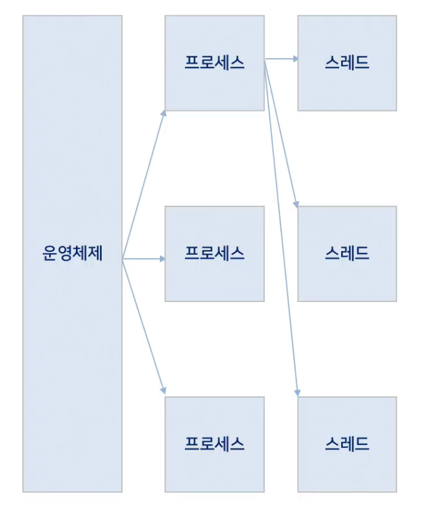
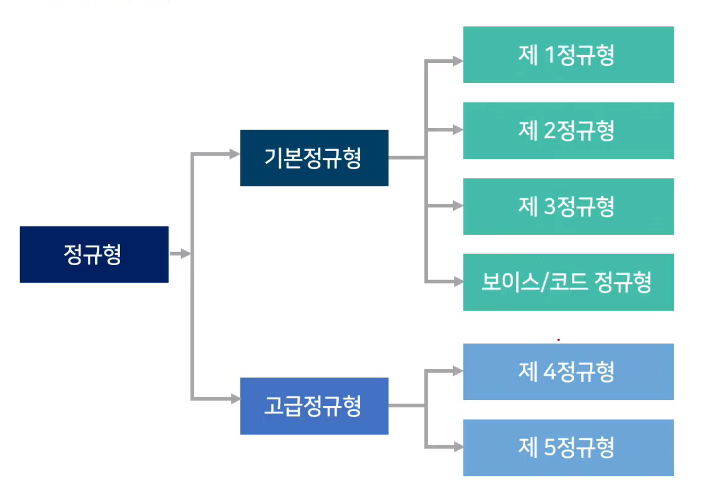

# CS 면접 핵심이론 (기본)
## CS 이론의 이해
### CS 기본이론의 필요성
1. 컴퓨터(시스템)에 대한 이해 (컴퓨터와 제대로 소통하기)
2. 자료구조, 알고리즘 활용법(일의 효율을 높이기)
3. Coder에서 Developer로 성장
4. 기업목적에 따른 기본적 CS 지식이 필요(게임회사, SNS회사에 필요한 역량은 다름)

### CS 개요

## CS 기본이론 정리
### 소프트웨어 공학
#### 기출문제
1. 소프트웨어 위기에 대해서 설명하시오.
    * 답변 Point: 소프트웨어 위기에 대한 **정형화된 답 보다는 실제 사례를 들어서 설명**합니다.
    * 답변 사례 예시
        * 2000년대 초반 많은 사람들이 이용했던 싸이월드가 이제는 사용되지 않는 것은 서비스에 대한 다양한 수요를 예측하지 못하고 반영하지 못한 대표적인 사례로 생각합니다. 소프트웨어 위기는 소프트웨어가 더 이상 사용자들의 요구를 충족할 수 없어서 사용자들로부터 외면 받는 것을 이야기합니다.
    * 소프트웨어 위기란?
        * 소프트웨어 공학 초기에 사용되던 용어로 정돈된 주제가 되기 이전에 사용되었다. 이 용어는 급격한 컴퓨터 계산 용량과 문제의 복잡성이 급격히 증가함에 따라 발생한 충격을 서술하기 위해서 사용되었다. 본질적으로, 이는 정확하고 이해할 수 있고, 검증 가능한 컴퓨터 프로그램을 작성하는 것이 얼마나 어려운가를 뜻한다.

2. 소프트웨어 공학이 필요한 이유는 무엇인지 설명하시오.
    * 답변 Point: 소프트웨어공학의 적용에 대해서 예시를 들어 설명합니다. **소프트웨어들을 비교하면 설명이 쉽습**니다.
    * 답변 사례 예시
        * 소프트웨어공학은 소프트웨어의 개발, 운용, 유지보수 등의 단계를 체계적으로 다루는 학문이라고 합니다. 제가 생각하는 소프트웨어 공학은 SSAFY에서 진행했던 프로젝트에서 단기간에 원하는 목적으로 이루기 위해서 소프트웨어를 기획하고, 설계하고, 구현하고, 테스트하고, 보완하는 과정을 거쳤는데 이 과정을 체계적으로 정리하고 이를 공유하는 과정이 소프트웨어 공학이 아닌가 생각합니다.

3. 소프트웨어 개발 경험과 소프트웨어 개발 시 적용한 개발 방법론이 있다면 설명하시오.
    * 답변 Point: 소프트웨어개발의 경험을 생각해보면 1개 이상의 방법론이 적용된 것을 알 수 있습니다. 개발 시 고려한 개발방법론이 없더라도 개발했던 **경험을 복기해서 가장 적절한 개발방법론**을 적용해봅니다.
    * 답변 사례 예시
        * SSAFY에서 프로젝트를 진행하며 **린 개발 방법을 찾아서 적용**했습니다. **린 개발 방법론의 가장 큰 특징은 낭비요소를 제거하고, 지속적인 개선과 수행속도의 향상과 더불어 품질을 효과적으로 개선**하는 것인데, SSAFY의 프로젝트가 기간이 짧아 어려움을 겪었습니다. 초기 서비스에 대한 방향성을 자신할 수 없어서 지속적으로 서비스를 향상할 수 있는 방법론이 필요했고, 그래서 린 개발 방법론을 찾아서 적용하게 되었습니다. 경험이 많지 않아서 린 개발 방법론의 적용이 쉽지는 않았지만, **단기간에 프로젝트를 완성하는데는 도움이 되었습니다**.

4. 소프트웨어 프로젝트 진행 경험에 대해서 설명하시오.
    * 답변 Point: 소프트웨어 진행 경험은 '무엇을 개발하였다'라기보단 '어떻게 개발하였다'라고 말하는 것이 필요합니다. 그 안에는 **개발방법론이나 소프트웨어 아키텍처를 들어서 설명하는 것이 필요**합니다.
    * 답변 사례 예시
        * 대학교 졸업을 위한 프로젝트로 빅데이터를 통한 관광정보 제공 서비스를 개발하였습니다. 관광정보에 대한 빅데이터를 수집하고 분석하여 이용자의 특성(연령, 성별, 지역)에 맞추어 관광정보를 제공하는 서비스를 개발하였습니다. 린(Lean)개발 방법론이 짧은 기간 개발에 적용하기에 적절하다고 하여 적용하였습니다.

#### 소프트웨어 개발 생명 주기
* 계획 단계에서 유지보수 단계에 이르기까지 일어나는 일련의 절차
<table>
  <tr>
    <td rowspan="3">정의 단계 WHAT (계획, 요구분석)</td>
    <td>타당성 분석</td>
    <td rowspan="3">사용자의 요구사항 확인 및 타당성 검토   개발에 필요한 요구사항 명세화</td>
  </tr>
  <tr>
    <td>개발계획</td>
  </tr>
  <tr>
    <td>요구사항 분석</td>
  </tr>
  <tr>
    <td rowspan="3">개발 단계 HOW (설계, 개발, 테스트)</td>
    <td>설계</td>
    <td rowspan="3">코딩을 통한 프로그램 개발   단위/통합/시스템/인수/설치테스트</td>
  </tr>
  <tr>
    <td>개발</td>
  </tr>
  <tr>
    <td>테스트</td>
  </tr>
   
  <tr>
    <td rowspan="2">유지보수 단계 CHANGE (적용, 예방, 폐기)</td>
    <td>유지보수</td>
    <td rowspan="2">시스템 운영 및 운영 중 발생한 문제점들에 대한 유지보수   새로운 시스템 개발로 인한 기존 시스템 폐기</td>
  </tr>
  <tr>
    <td>폐기</td>
  </tr>
   
</table>

#### 소프트웨어 개발 프로세스 정의
* 작업(task)순서의 집합 +  제약조건(일정, 예산, 자원)을 포함하는 일련의 활동
* 좁은 의미: 사용자의 요구사항을 SW로 구현하기 위한 절차, 과정
* 넓은 의미: 사용자의 목적을 이루기 위한 기획, 프로젝트 관리 등을 포함한 절차, 과정, 방법
* 소프트웨어개발 7단계
    * 계획 > 요구분석 > 설계 > 구현 > 테스트 > 반영 > 유지보수

#### 소프트웨어 프로세스 모델

* 방법론은 이렇게 해야 한다가 아닌 이렇게 하고있다.

#### 소프트웨어 아키텍처
* 정의
    * 소프트웨어에 대한 전체적인 구조
    * 소프트웨어를 이루고 있는 여러 구성 요소(서브시스템, 컴포넌트)
    * 구성 요소들의 인터페이스 간의 상호작용 정의
    * 시스템 설계와 개발 시 적용되는 원칙과 지침
* 구성
    * 구성 요소
    * 구성 요소들 사이의 관계
    * 구성 요소들이 외부에 드러내는 속성
    * 구성 요소들과 주변 환경 사이의 관계
    * 구성 요소들이 제공하는 인터페이스
    * 구성 요소들의 협력 및 조립 방법

#### 아키텍처 모델
##### 데이터 중심형 모델
* 주요 데이터가 repository에서 중앙관리
* repository와 여기에 접근하는 서브시스템으로 구성
* 데이터가 한군데에 모여있기 때문에 데이터를 모순되지 않고 일관성있게 관리 가능
* 새로운 서브시스템의 추가 용이
* repository의 병목현상 발생 가능
* 서브시스템과 repository 사이의 강한 결합 - repository 변경 시 서브시스템에 영향을 줌

##### Client-Server 모델
* 네트워크를 이용하는 분산 시스템
* 데이터와 처리 기능을 클라이언트와 서버에 분할하여 사용
* 서버: 클라이언트(서브시스템)에 서비스 제공
* 클라이언트: 서버가 제공하는 서비스를 요청(호출)하는 서브시스템

##### Layering 모델
* 기능을 몇 개의 계층으로 나누어 배치
* 구성: 하위 계층은 서버, 상위 계층은 클라이언트 역할

##### MVC 모델 (Model/View/Controller 모델)
* 같은 모델의 서브시스템에 대하여 여러 뷰 서브시스템을 필요로 하는 시스템에 적합
* 장점
    * 데이터를 화면에 표현(뷰)하는 디자인과 로직(모델)을 분리함으로써 느슨한 결합 가능
    * 구조 변경 요청 시 수정 용이
* 단점
    * 기본 기능 설계로 인한 클래스 수의 증가로 복잡도 증가
    * 속도가 중요한 프로젝트에 부적합

### 프로그래밍 언어
#### 기출문제
5. 자바와 C의 차이를 설명하시오.
    * 답변 Point: 절차지향 vs 객체지향 / 하드웨어 최적화 vs 하드웨어 독립적 등의 여러 관점에서 비교 설명합니다.
    * 답변 사례 예시
        * C언어는 아두이노를 활용한 IoT 수업에 사용하였었고, 자바는 안드로이드 어플 제작할 때 사용했습니다. **하드웨어를 제어할 때 C언어가 적합한 언어라고 생각**합니다. 자바를 사용할 때에는 다양한 유형의 데이터를 정의와 데이터간의 관계를 설정, 사용자의 동작을 정의, 구현하는 과정을 거쳤는데, 실제 업무와 유사하여 **규모 있는 프로젝트를 개발할 때 자바가 적합했던 언어**였습니다.
        또한 개발 환경에 있어서도 윈도우 환경에서 개발한 프로그램을 그대로 리눅스 기반으로 알고있는 안드로이드 환경에 JVM이라는 것을 통해서 하드웨어 독립적으로 운영이 가능한 것이 C언어와 차이라고 할 수 있습니다.

6. JVM 가비지컬렉션 동작 과정을 설명하시오.
    * 답변 Point: 가비지 컬렉션은 메모리와 연관됩니다. 소프트웨어 개발 경험 중 메모리 부족현상을 겪은 경험이 있으면, 경험을 토대로 설명하세요.
    * 답변 사례 예시
        * 가비지컬렉션은 **JVM에서 메모리 관리를 하는 방법으로 더 이상 사용하지 않는 메모리에 대해서 수집해서 스스로 동작해서** 사용을 해제하는 기능입니다. **C언어를 사용할 때에는 코드에서 메모리의 할당과 함께 해제를 같이 처리해주었는데**, **자바에서는** 직접 해제하는 기능은 없었고, **사용하지 않는 메모리에 대해서는 메모리의 참조변수에 null을 대입해서 참조변수에 연결된 메모리가 더 이상 사용하지 않음을 JVM에 알려주는 것만으로 메모리 해제 요청을 하였**습니다.

7. JAVA에 적용된 OOP에 대해서 설명하시오.
    * 답변 Point: 실제 작업한 사례를 통해서 설명하세요. 설계한 객체와 클래스를 비교해서 설명하세요.
    * 답변 사례 예시
        * [관광정보 제공 서비스 프로젝트 개발]
            * 서비스에서 제공되는 주요 정보인 관광지/식당/호텔 등을 객체로 정의
            * 관광지를 모델링 한 것을 객체 / 모델링한 관광지를 자바의 코드로 정의한 것은 클래스
            * 각 클래스에 실제 관광지의 값을 대입하여 메모리에 올린 것은 인스턴스
                * 주요 모델링한 정보: 관광지의 이름 / 관광지의 주소 / 관광지의 위경도 / 관광기 길 탐색 기능
                * 클래스에서는 관광지의 이름은 PLACE_NAME의 String 타입으로 정의
                * 관광지의 위/경도는 PLACE_LAT, PLACE_LNG의 double 타입으로 정의
                * 길을 탐색하는 기능은 navigate 라는 메소드로 구현
                * 객체는 실 세계를 모델링 한 것이면 클래스는 모델링 한 것을 실제 코드로 구현한 것입니다.

8. 형상관리 활용 경험을 설명하시오.
    * 답변 Point: 형상관리의 경험이 있다면, 형상관리의 경험을 이야기합니다. 형상관리의 경험이 없다면, 회사에서 제공하는 서비스나 소프트웨어를 대상으로 필요성을 설명합니다.
    * 답변 사례 예시
        * 저는 4명의 팀원과 함께 프로젝트를 진행하였습니다. 이 중에 2명은 라이브러리를 개발하고 1명은 서버측을 1명은 사용자 화면 및 동작을 개발하였습니다. **동시에 같이 개발하면서 서로의 코드를 참조하고, 확인을 위해 SVN을 이용해서 형상관리**를 진행하였습니다.
        SVN을 활용한 형상관리를 하면서 코드 작업 후 업데이트 할 때 오류가 있는 코드를 업데이트 하거나, 업데이트 시 정확한 코멘트를 남기지 않아서 애를 먹었던 경험도 있습니다. 초반에는 혼란을 겪었지만, 수시로 베이스 라인 변경과 통제를 통해 형상관리 프로젝트를 체계적으로 관리할 수 있었습니다.

9. 리팩토링이란 무엇인지 설명하시오.
    * 답변 Point: 프로그래밍 사용 시 리팩토링 경험을 이야기하거나, 작성했던 코드를 개선하는 방향으로 답변합니다.
    * 답변 사례 예시
        * 리팩토링은 결과의 변경 없이 코드의 구조를 재조정하여 가독성을 높이고 유지보수를 편하게 하는데 적용하는 방법입니다. 저는 4명의 팀원과 함께 프로젝트를 진행하였고, 프로젝트를 진행하면서 서로의 코드를 리뷰하는 시간을 가졌고, 코드를 리뷰하면서 코드를 지속적으로 개선했습니다.

#### 컴퓨터 프로그래밍
* 컴퓨터 프로그램
    * 어떤 목표를 이루기 위해 컴퓨터에 제시하는 계획
* 코드(Code)
    * 암호 혹은 부호 - 모스 부호(Morse Code)
    * "코드 짜기" - 컴퓨터가 이해하기 쉬운 암호를 작성
* 빌드(Build)
    * 작성한 코드를 컴퓨터가 이해할 수 있는 형태로 번역하는 작업

#### 프로그래밍 언어
* C
    * 새로 개발된 유닉스 운영체제에서 사용하기 위해 개발한 프로그래밍 언어
    * 유닉스 시스템의 바탕 프로그램은 모두 C로 작성 
    * 수많은 운영체제의 커널 또한 C로 작성
* C++
    * C언어에 객체지향 프로그래밍을 지원
    * 초기에는 C++ 프로그램을 일단 C프로그램으로 변환하고 나서 C 컴파일러로 컴파일
    * C언어에 대해 상위 호환성을 갖는 언어
    * C++언어의 표준 규격은 복잡
* JAVA
    * 객체지향적 프로그래밍 언어
    * 처음에는 가전제품 내에 탑재해 동작하는 프로그램을 위해 개발
    * 웹 애플리케이션 개발과 모바일 기기용 소프트웨어 개발에도 널리 사용
    * 가장 큰 특징은 컴파일된 코드가 플랫폼 독립적
* PHP
    * 동적 웹 페이지를 만들기 위해 설계되었으며 이를 구현하기 위해 PHP로 작성된 코드
    * PHP는 명령 줄 인터페이스 방식의 자체 인터프리터를 제공
    * 범용 프로그래밍 언어로도 사용
* Python
    * 플랫폼 독립적이며 인터프리터식, 객체지향적, 동적 타이핑(dynamically typed) 대화형 언어
    * 동적 타이핑(dynamic typing) (실행 시간에 자료형을 검사한다)
    * 객체의 멤버에 무제한으로 접근(속성이나 전용의 메서드 훅을 만들어 제한할 수는 있음.)\
    * 모듈, 클래스, 객체와 같은 언어의 요소가 내부에서 접근
* 블록 프로그래밍
    * 스크래치/엔트리
        * 레고처럼 블록을 마우스로 끌어다 연결해 가며 프로그램 작성
    * 앱인벤터 - 안드로이드 기반 어플리케이션 개발

#### 데이터 분석 언어
* Python
    * Python은 좀더 본격적은 범용 개발 언어이고, R은 통계쪽으로 특화된 패키지 많음
* R
    * 통계 계산과 그래픽을 위한 프로그래밍 언어이자 소프트웨어 환경
    * 통계 소프트웨어 개발과 자료 분석에 널리 사용
    * 패키지 개발이 용이해 통계 소프트웨어 개발
    * 다양한 통계 기법과 수치 해석 기법을 지원
    * 그래픽 기능으로 수학 기호를 포함할 수 있는 출판물 수준의 그래프를 제공

#### 인공지능 언어
* Python
    * 넘파이(NumPy, 텐서연산), 판다스(Pandas, 데이터프레임)
    * 자연어처리(NLP) - NLTK, 스페이시(SpaCy)
    * 머신러닝 - 사이킷-런(Scikit-learn)
    * 딥러닝 - 텐서플로우(TensorFlow), 파이토치(PyTorch), 체이너(Chainer), 아파티 MXNet(Apache MXNet), 테아노(Theano) 등
* JAVA
    * 자연여 처리(CoreNLP), 텐서 연산(ND4J) 또는 GPU 가속 딥 러닝 스택(DL4J)
* C/C++
    * CUDA, 텐서플로우 또는 카페(Caffe), 러스트(Rust)
* Javascript
    * TensorFlow.js (구글이 제작한 머신러닝 모델의 학습 및 실행이 가능한 WebGL 가속 라이브러리)
    * 케라스(Keras) API
* 루아 (Lua)
    * 토치(Torch) 프레임워크와 함께 딥 러닝 개발에서 가장 인기 있는 언어였음.
* 줄리아 (Julia)
    * 수치 연산에 초점을 둔 고성능 프로그래밍 언어
    * TensorFlow.jl, 모카(Mocha - 카페의 영향을 크게 받음)와 같은 래퍼는 딥 러닝을 충실하게 지원
* 텐서플로우용 스위프트 (Swift)
    * 파이썬이 제공하는 사용의 용이함과 컴파일 언어의 속도 및 정적 형식 확인을 결합하는 것을 목표

#### 객체지향
##### 객체지향 개요
* 소프트웨어 객체는 현실세계의 객체를 필드와 메서드로 모델링한 것
* 소프트웨어 객체는 상태를 필드(Field)로 정의하고, 동작을 메서드(Method)로 정의
* 필드는 객체 내부에 **선언된 변수**를 의미하고, 메서드는 객체 내부에 **정의된 동작**을 의미함
* 절차지향
    * 일련의 동작을 순서에 맞추어 단계적으로 실행하도록 명령어를 나열
    * 데이터를 정의하는 방법보다는 명령어의 순서와 흐름에 중점
* 객체지향
    * 현실 세계를 객체 단위로 프로그래밍하며, 객체는 필드(데이터)와 메서드(코드)를 하나로 묶어 표현
    * 프로그램을 유연하고 변경히 용이하게 만들기 때문에 대규모 소프트웨어 개발에 많이 사용
    * 소프트웨어 개발과 보수를 간편하게 하며, 보다 직관적인 코드 분석을 가능

##### 객체지향 주요 개념
* 캡슐화(정보은닉)
    * 필드와 메서드를 하나의 캡슐처럼 포장해 세부 내용을 외부에서 알 수 없도록 감추는 것
* 상속
    * 상위 객체를 상속받은 하위객체가 상위 객체의 메서드와 필드를 사용하는 것
* 다형성
    * 대입되는 객체에 따라서 메서드를 다르게 동작하도록 구현하는 기술
    * 실행 도중 동일한 이름의 다양한 구현체 중에서 메서드를 선택 가능

##### 객체지향 프로그래밍 언어 - JAVA
* JAVA의 목적
    * "Write Once Run Anywhere"
    * JAVA는 platform independent하게 동작
    * Super Computer부터 Smart Card까지 한번 작성된 코드는 코드의 수정이 없이, 코드의 재컴파일 없이 실행 가능

* JAVA 언어의 개발 목적
    * Program 개발을 쉽게 하였다.
    * Compile 환경이 아니라, Interpreted 환경이다.
    * 한 개의 이상의 thread를 사용할 수 있다.
    * 동적으로 program을 변화시킬 수 있다.
    * Code 자체적으로 security를 보장해 준다.

* JAVA Virutal Machine
    * JVM은 System마다, 그리고 운영체제마다 다름
    * Java Application에서는 JDK 안에서 실행
    * Applet의 경우에는 browser 안에 JVM (*.jar가 그 역할을 한다.)이 있어서 java Code를 실행
    * JAVA Compiler는 Source Code를 JVM에 대한 machine code instruction으로 변환하면, JVM으로 구현된 development tool에 의해서 interpreted 됨

* Garbage Collection
    * JAVA는 프로그래머에게 메모리를 release(최적화)하게 하는 책임을 지우지 않음.
    * Garbage Collector는 Java Program의 life cycle동안 자동적으로 동작해서 de-allocate 메모리에 필요와 메모리의 부족을 제거
    
* Process의 개념
    * 프로그램 - 저장장치에 저장되어 있는 정적인 상태
    * 프로세스 - 실행을 위해 메모리에 올라온 동적인 상태
    * 프로그램이 프로세스가 된다는 것은 운영체제로부터 프로세스 제어 블록을 얻는다는 뜻
    * 프로세스가 종료된다는 것은 해당 프로세스 제어 블록이 폐기된다는 뜻
* Thread의 개념
    * 프로세스에서 실행 제어만 분리한 실행 단위 (프로세스 시행부)
    * 프로세서를 사용하는 기본단위이며, 명령어를 독립적으로 실행할 수 있는 하나의 제어 흐름
    * 같은 그룹의 스레드는 코드, 주소 공간, 운영체제의 자원(파일, 신호) 등을 공유
* 멀티태스킹
    * 운영체제가 CPU에 작업을 줄 때 시간을 잘게 나누어 배분하는 기법
* 멀티프로세싱
    * CPU를 여러 개 사용하여 여러 개의 Thread를 동시에 처리하는 작업 환경
* CPU 멀티 Thread
    * 하드웨어적인 방법으로 하나의 CPU에서 여러 Thread를 동시에 처리하는 병렬처리 기법
* 멀티 Thread
    * 운영체제가 소프트웨어적으로 프로세스르 작은 단위의 Thread로 분할하여 운영하는 기법

* 병행성(concurrency) 문제
    * 두 개 이상의 Thread가 어떤 객체에 있는 하나의 데이터에 접근하게 되는 경우
    * 서로 다른 두 스택에서 실행되는 메소드가 객체에 있는 동일한 객체에 대한 getter 또는 setter 메소드를 호출하게 되는 경우
    * Thread는 자신이 잠시 중단된 적이(interrupt) 있다는 것을 기억할 수가 없음
* Thread에서의 동기화
    * 다중 Thread 환경에서 한번에 하나의 쓰레드 만이 공유 데이터를 접근할 수 있도록 제어하는 것
    * 여러 Thread가 동시에 실행되는 다중 Thread에서 데이터를 공유하기 위해서는 어떤 Thread가 다른 Thread의 상태와 행동 등을 고려

#### 형상관리
* 정의
    * SW 개발 및 유지보수 과정에서 발생하는 변경 사항들을 관리하기 위해 개발된 일련의 활동 (소프트웨어 개발의 전 단계에 적용되는 활동으로, 유지보수 단계에서 수행)
* 목적
    * 형상관리는 소프트웨어 개발의 전체 비용을 줄이고, 개발 과정의 여러 방해 요인이 최소화되도록 보증함
* 주요 기능
    * 버전관리 (Version Control)
    * 리비전 관리 (Revision Control)
    * 소스관리 (Source Control)
    * 소스코드 관리 (Source Sode Management)
* 종류
    * SVN, git, Mercurial, Bazaar 등, 주로 SVN과 git을 사용
    * SVN
        * 중앙 집중 모델
        * 소규모 시스템 적합
        * 간단한 기능과 간단한 조작법
        * 브랜치 merge 작업의 부담이 큼
        * 안정된 네트워크 환경
    * git
        * 분산 개발 모델
        * 대규모 시스템 적합
        * 높은 오픈 소스 활용도와 다양한 기능
        * Commit할 때 메세지의 강제성
        * 사설 저장소 이용에 대한 비용 발생
        * 필요 학습 필요

#### 빌드도구
* 소스코드를 컴파일, 테스트, 정적 분석 등을 실시하여 실행 가능한 애플리케이션으로 자동 생성하는 프로그램(프로젝트를 진행하며 시간이 지남에 따라 라이브러리 버전을 자동으로 동기화)

<table>
    <tr>
        <td>ANT<td>
        <td>XML 기반 빌드 스크립트 개발   명확한 빌드 절차 정의가 필요<td>
    </tr>
    <tr>
        <td>MAVEN<td>
        <td>프로젝트에 필요한 모든 종속성(Dependency)를 리스트의 형태로 관리   전자정부프레임워크<td>
    </tr>
    <tr>
        <td>Gradle<td>
        <td>ANT와 MAVEN의 단점을 보완한 오픈소스 기반의 Build 자동화 도구   안드로이드 스튜디오<td>
    </tr>
</table>

#### 디자인패턴
* 자주 사용하는 설계 형태를 정형화해서 이를 유형별로 설계 템플릿을 만들어둔 것
* 많은 개발자들이 경험상 체득한 설계 지식을 검증하고 이를 추상화하여 일반화한 템플릿
* 클래스 라이브러리 구현 시, 디자인 패턴이 적용된다.
* 장점
    * 개발자(설계자) 간의 원활한 소통
    * 소프트웨어 구조 파악 용이
    * 재사용을 통한 개발 시간 단축
    * 설계 변경 요청에 대한 유연한 대처
* 단점
    * 객체지향 설계 / 구현 위주
    * 초기 투자 비용 부담

 

* 개요
    * 디자인패턴은 클래스 라이브러리가 아니다.
    * 클래스 라이브러리 구현 시, 디자인 패턴이 적용된다.
    * 모든 행동 양식에는 패턴이 존재한다.
    * OOD에도 패턴이 존재함을 발견 : 23가지 패턴
    * Design Pattern의 정의
        * S/W 설계 시 반복적으로 나타나는 일련의 규칙을 정의한 것
    * 고급 설계자는 DP를 사용한다.
        * 개발자도 설계자의 의도를 잘 파악해야 한다.
* 예시: MVC 패턴
    * Model-View-Controller 패턴
    * Java 등에서 User Interface를 만들기 위한 패턴
        * Model (data) : 화면에 출력될 자료 관리
        * View : 화면 출력 담당
        * Controller : 사용자와 view간의 상호작용을 담당
    * MVC는 view와 model을 분리하고 이들 간의 "subscribe/notify" 프로토콜을 이용하여 동작

* 디자인 패턴의 3가지 유형
    * Creational Pattern
        * 객체를 생성하는데 관련된 패턴들
        * 객체가 생성되는 과정에 유연성을 높이고, 코드의 유지가 쉬워진다.
        * Abstract Factory, Prototype, Singleton, Factory Method, Builder
    * Structural Pattern
        * 프로그램의 구조에 관련된 패턴들
        * 프로그램내의 자료구조나 인터페이스 구조 등 프로그램의 구조를 설계하는데 많이 활용될 수 있는 패턴들
        * Adapter, Bridge, Composite, Decorator, Flyweight, Facade, Proxy
    * Behavioral Pattern
        * 반복적으로 사용되는 객체들의 상호작용을 패턴화 해 놓은 것
        * Chain of Responsibility, Command, Interpreter, Iterator, Mediator, Memento, Observer, State, Strategey, Template, Visitor

#### 리팩토링
* 개요
    * 설계 개선
        * 요구변경에 유연한 모델
        * 구현 레벨에서의 코드의 유연성 향상
    * 나쁜 구조
        * 비슷한 (중복된) 코드는 한 곳으로 모은다 (클래스 다이어그램 변경)
        * '리팩토링에 의한 설계': 켄트 벡
        * '코드구조의 개량절차': 마틴 파울러
    * 나쁜 냄새(Bad smell)
        * 리팩토링의 시점을 알려주는 지침 중 하나
        * 중복된 코드, 너무 긴 메소드, 거대한 클래스, 지나치게 많은 파라미터, 확산적 변경, 변경의 분산, 속성-조작에 욕심, 데이터 덩어리, 기본 데이터 타입에 대한 집착, Switch 문, 병렬 상속 구조, 게으른 클래스, 지나친 일반화, 임시 속성, 메시지 체인, 미들 맨, 부적절한 친밀성, 다른 인터페이스를 가진 대체 클래스, 미완성 클래스 라이브러리, 데이트 클래스, 상속 거부, 주석
    * 리팩토링의 방법 (리팩토링: 프로그램의 체질개선 테크닉)
        * (SW의) 외부적인 행동은 바꾸지 않는다
        * 내부 구조를 다듬어 간다
        * 작업은 한 스텝씩 진행하고 안전하게 변경을 수행한다.
* 정의
    * 결과의 변경 없이 코드의 구조를 재조정함을 뜻한다. (가독성을 높이고 유지보수를 하여 내부논리나 구조를 바꾸고 개선하는 행위)

### 자료구조
#### 기출문제
10. Stack과 Queue의 차이점에 대해서 설명하세요.
    * 답변 point: 스택과 큐의 자료 구조 방법을 설명하되, 실제 구현한 예를 사용하여 설명합니다.
    * 답변 사례 예시:
        * 스택은 바스켓과 같은 형태로 처음에 들어간 것이 나중에 나오는 형태로 데이터를 관리하고, 큐는 파이프와 같은 형태로 처음에 들어간 것이 처음에 나오는 형태로 데이터를 관리합니다. 스택과 같은 예는 웹 브라우저에서 페이지 이동 시 페이지 정보를 저장하고 있다가 뒤로가기를 하면 이전 페이지를 불러서 호출하는 것과 같은 방법이고, 큐는 선착순 접수를 구현할 때 접수한 순서대로 처리하는 것을 구현할 때 사용합니다.

11. JAVA에서 Stack, Heap을 설명하세요.
    * 답변 point: 자바에서 메모리 관리 방법을 설명합니다. 이 중에서  Stack 메모리와 Heap 메모리의 역할과 동작방법에 대해서 설명합니다.
    * 답변 사례 예시:
        * 스택은 바스켓과 같은 형태로 처음에 들어간 것이 나중에 나오는 형태로 데이터를 관리하고, 큐는 파이프와 같은 형태로 처음에 들어간 것이 처음에 나오는 형태로 데이터를 관리합니다. 스택과 같은 예는 웹 브라우저에서 페이지 이동 시 페이지 정보를 저장하고 있다가 뒤로가기를 하면 이전 페이지를 불러서 호출하는 것과 같은 방법이고, 큐는 선착순 접수를 구현할 때 접수한 순서대로 처리하는 것을 구현할 때 사용합니다.
#### 자료구조의 분류
* 정의
    * 자료를 효율적으로 표현하고 저장하고 처리할 수 있도록 정리하는 것
* 자료의 분류
    * 단순 구조
        * 정수, 실수, 문자열 등의 기본 자료형
    * 선형 구조
        * 자료들 사이의 관계가 1:1관계/순차리스트, 연결리스트, 스택, 큐, 데크 등
    * 비선형 구조
        * 자료들 사이의 관계가 1:다, 또는 다:다 관계 / 트리, 그래프 등
    * 파일 구조
        * 서로 관련 있는 필드로 구성된 레코드의 집합인 파일에 대한 구조
        * 순차 파일, 색인 파일, 직접 파일 등

##### 순차 자료구조
* 개념
    * 구현할 자료들을 논리적 순서로 메모리에 연속 저장하는 구현 방식
    * 논리적인 순서와 물리적인 순서가 항상 일치해야 함
    * C 프로그래밍에서 순차 자료구조의 구현 방식 제공하는 프로그램 기법은 배열

##### 선형리스트
* 리스트
    * 자료를 구조화하는 가장 기본적인 방법은 나열하는 것
* 선형 리스트(Linear List)
    * 순서 리스트(Ordered List)
    * 자료들 간에 순서를 갖는 리스트

##### 연결 자료구조
* 자료의 논리적인 순서와 물리적인 순서가 불일치
    * 각 원소에 저장되어 있는 다음 원소의 주소에 의해 순서가 연결되는 방식
    * 물리적인 순서를 맞추기 위한 오버헤드가 발생하지 않음
* 연결리스트의 종류
    * 연결하는 방식에 따라 단순 연결 리스트와 원형 연결 리스트, 이중 연결 리스트, 이중 원형 연결리스트가 있음.

    |구분|순차 자료구조|연결 자료구조|
    |---|---|---|
    |메모리 저장 방식|메모리의 저장 시작 위치부터 빈자리 없이 자료를 순서대로 연속하여 저장 논리적 순서와 물리적 순서가 일치|메모리에 저장된 물리적 위치가 순서와 상관없이 링크에 의해서 논리적인 순서를 표현하는 구현방식|
    |연산특징|삽입, 삭제 연산 후 자료가 순서대로 연속하여 저장   변경된 논리적인 순서와 물리적 순서가 일치|삽입, 삭제 연산을 하여 논리적인 순서가 변경되어도, 링크 정보만 변경되고, 물리적인 순서가 변경되지 않음|
    |프로그램 기법|배열을 이용|포인터를 이용|

##### 연결리스트
* 단순 연결 리스트
    * 개념
        * 노드가 하나의 링크 필드에 의해서 다음 노드와 연결되는 구조를 가짐
        * 연결 리스트, 선형 연결 리스트, 단순 연결 선형 리스트
* 원형 연결 리스트
    * 단순 연결 리스트에서 마지막 노드가 리스트의 첫 번째 노드를 가리키게 하여 리스트의 구조를 원형으로 만든 연결 리스트
    * 단순 연결 리스트의 마지막 노드의 링크 필드에 첫 번째 노드의 주소를 저장하여 구성
    * 링크를 따라 계속 순회하면 이전 노드에 접근 가능
* 이중 연결 리스트
    * 양쪽 방향으로 순회할 수 있도록 노드를 연결한 리스트

##### 스택
* 정의
    * 접시를 쌓듯이 자료를 차곡차곡 쌓아 올린 형태의 자료구조
    * 스택에 저장된 원소는 top으로 정한 곳에서만 접근 가능
    * Top의 위치에서만 원소를 삽입하므로, 먼저 삽입한 원소는 밑에 쌓이고, 나중에 삽입한 원소는 위에 쌓이는 구조
    * 마지막에 삽입(Last-In)한 원소는 맨 위에 쌓여있다가 가장 먼저 삭제(First-Out) 됨
    * 후입선출 구조(LIFO, Last-In-First-Out)

##### 큐
* 정의
    * 스택과 비슷한 삽입과 삭제의 위치가 제한되어 있는 유한 순서 리스트
    * 큐는 뒤에서 삽입만 하고, 앞에서는 삭제만 할 수 있는 구조
    * 삽입한 순서대로 원소가 나열되어 가장 먼저 삽입(First-In)한 원소는 맨 앞에 있다가 가장 먼저 삭제(First-Out) 됨
    * 선입선출 구조(FIFO, First-In-First-Out)

##### 데크 (Deque: double-ended queue)
* 정의
    * 큐 두개 중 하나를 좌우로 뒤집어서 붙인 구조
    * 큐의 양쪽 끝에서 삽입 연산과 삭제 연산을 수행할 수 있도록 확장한 자료구조

##### 트리
* 정의
    * 원소들 간에 1:n 관계를 가지는 비선형 자료구조
    * 원소들 간에 계층관계를 가지는 계층형 자료구조 (Hierarchical Data Structure)
    * 상위 원소에서 하위 원소로 내려가면서 확장되는 트리(나무) 모양의 구조
* 이진트리
    * 정의
        * 트리의 모든 노드의 차수를 2 이하로 제한하여 전체 트리의 차수가 2 이하가 되도록 정의
        * 이진트리의 모든 노드는 왼쪽 자식 노드와 오른쪽 자식 노드만 가짐
        * 부모 노드와 자식 노드 수와의 관계 => 1:2
        * 공백 노드도 자식 노드로 취급
        * 0 <= 노드의 차수 <= 2
    * 종류
        * 포화 이진트리 Full Binary Tree
            * 모든 레벨에 노드가 포화상태로 차 있는 이진트리
        * 완전 이진트리 Complete Binary Tree
            * 높이가 h이고 노드 수가 n개일 때 (단, n < 2h+1-1), 노드 위치가 포화 이진트리에서의 노드 1번부터 n번까지의 위치와 완전히 일치하는 이진트리
        * 편향 이진트리 Skewed Binary Tree
            * 높이가 h일 때 h+1개의 노드를 가지면서 모든 노드가 왼쪽이나 오른쪽 중 한 방향으로만 서브 트리를 가지고 있는 트리

##### 그래프
* 정의
    * 연결되어 있는 원소 사이의 다:다 관계를 표현하는 자료구조
* 그래프 G
    * 객체를 나타내는 정점(vertex)과 객체를 연결하는 간선(edge)의 집합
    * G = (V, E)
    * V는 그래프에 있는 정점들의 집합
    * E는 정점을 연결하는 간선들의 집합
* 종류
    * 무방향 그래프(Undirected graph)
        * 두 정점을 연결하는 간선에 방향이 없는 그래프
    * 방행 그래프(directed graph), 다이그래프(digraph)
        * 간선에 방향이 있는 그래프
    * 완전 그래프(complete graph)
        * 각 정점에서 다른 모든 정점을 연결하여 최대로 많은 간선 수를 가진 그래프
    * 부분 그래프(subgraph)
        * 원래의 그래프에서 정점이나 간선을 일부만 제외하여 만든 그래프
    * 가중 그래프(weight graph), 네트워크(network)
        * 정점을 연결하는 간선에 가중치(weight를 할당한 그래프)

#### 알고리즘
* 정의
    * 문제해결 방법을 추상화 하여 단계적 절차를 논리적으로 기술해 놓은 명세서
* 조건
    * 입력: 알고리즘 수행에 필요한 자료가 외부에서 입력으로 제공
    * 출력: 알고리즘 수행 후 하나 이상의 결과를 출력
    * 명확성: 수행할 작업의 내용과 순서를 나타내는 알고리즘의 명령어들은 명확하게 정의되어야 함
    * 유한성: 알고리즘은 수행 뒤에 반드시 종료
    * 효과성: 알고리즘의 모든 명령어들은 기본적이며 실행이 가능해야 함

##### 정렬
* 정의
    * 순서 없이 배열된 자료를 작은 것부터 큰 순서인 오름차순 Ascending이나 큰 것 부터 작은 것 순서인 내림차순 Descending으로 재배열하는 것
    * 키(Key) - 자료를 정렬하는데 사용하는 기준이 되는 특정 값
* 종류
    * 선택 정렬(selection sort)
        * 전체 원소들 중에서 기준 위치에 맞는 원소를 선택하여 자리를 교환하는 방식으로 정렬
    * 버블 정렬(bubble sort)
        * 인접한 두 개의 원소를 비교하여 자리를 교환하는 방식
    * 퀵 정렬(quick sort)
        * 정렬할 전체 원소에 대해서 정렬을 수행하지 않고, 기준 값을 중심으로 왼쪽 부분 집합과 오른쪽 부분 집합으로 분할하여 정렬하는 방법
    * 삽입 정렬(insertion sort)
        * 정렬되어있는 부분집합에 정렬할 새로운 원소의 위치를 찾아 삽입하는 방법

##### 검색
* 정의
    * 컴퓨터에 저장한 자료 중에서 원하는 항목을 찾는 작업
    * 탐색 키를 가진 항목을 찾는 것
* 탐색 키(search key)
    * 자료를 구별하여 인식할 수 있는 키
* 삽입/삭제 작업에서의 검색
    * 원소를 삽입하거나 삭제할 위치를 찾기 위해서 검색 연산 수행
* 수행 위치에 따른 분류
    * 내부 검색: 메모리 내의 자료에 대해서 검색 수행
    * 외부 검색: 보조 기억 장치에 있는 자료에 대해서 검색 수행
* 검색 방식에 따른 분류
    * 비교 검색 방식: 검색 대상의 키를 비교하여 검색, 순차검색, 이진검색, 트리검색
    * 계산 검색 방식: 계수적인 성질을 이용한 계산으로 검색, 해싱
* 종류
    * 순차 검색(sequential search), 선형 검색(linear search)
        * 일렬로 된 자료를 처음부터 마지막까지 순서대로 검색하는 방법
    * 색인 순차 검색(index sequential search)
        * 정렬되어 있는 자료에 대한 인덱스 테이블(index table)을 추가로 사용하여 탐색 효율을 높인 검색 방법
    * 이진 검색, 이분 검색, 보간 검색
        * 자료의 가운데에 있는 항목을 키 값과 비교하여 다음 검색 위치를 결정하여 검색을 계속하는 방법
    * 이진트리 검색
        * 이진 탐색 트리를 사용한 검색 방법
    * 해싱
        * 산술적인 연산을 이용하여 키가 있는 위치를 계산하여 바로 찾아가는 계산 검색 방법
        * 키 값에 대해서 해시 함수를 계산하여 주소를 구하고, 구한 주소에 해당하는 해시 테이블로 바로 이동

### 데이터베이스
12. View에 대해 설명하시오.
    * 답변 point: View 사용 경험을 예를 들어서 설명합니다.
    * 답변 사례 예시
        * SSAFY 2학기 과정 중 관광정보 정보서비스 제공 프로젝트를 개발할 때 제공되는 정보에는 관광정보에 관광 후기 / 사진정보 등의 여러 정보를 제공해야 했는데, **하나의 쿼리로 데이터를 불러오는 것이 쉽지 않아서 관광정보의 목록을 보여주는 View와 관광지의 정보를 보여주는 View를 만들어서 사용**하였습니다.

13. 인덱스에 대해 설명하시오.
    * 답변 point: 인덱스 사용경험을 예를 들어서 설명합니다. 인덱스를 사용할 때와 사용하지 않을 때의 결과를 비교해서 설명합니다.
    * 답변 사례 예시
        * 관광정보를 제공하는 서비스를 개발하면서 관광정보에 대한 사용자 후기 정보를 크롤링해서 수집했습니다. 관광정보의 후기 **정보의 수집건수가 만 건 이상이 수집되면서 조회속도와 검색 속도가 많이 늦어졌습니다. 이 부분을 해결하기 위해서 검색의 대상이 되는 필드에 대해서 인덱스를 설정하여 속도를 향상**하였습니다.
        
14. No SQL (비정형 데이터)이 갖는 장점을 설명하시오.
    * 답변 point: No SQL은 빅데이터를 저장할 때 많이 사용합니다. No SQL과 관계형 데이터베이스를 비교해서 설명합니다.
    * 답변 사례 예시
        * NoSQL은 비관계형이기 때문에 정해진 테이블에 하나씩 데이터를 집어넣어 사용할 수 있으며, 다른 데이터 구조를 가져와 사용할 수도 있기 때문에 대규모의 데이터를 유연하게 처리할 수 있고 설계가 단순하고 데이터의 확장에 훨씬 유리합니다. NoSQL은 대량의 데이터를 무한대로 추가하여 저장할 수 있으며, 가변성이 있는 데이터의 저장도 용이하여, 결과적으로 유지보수에 적은 비용이 발생합니다.

#### 데이터의 분류
<table>
    <tr>
        <td>정형 데이터</td>
        <td>구조화된 데이터, 즉 미리 정해진 구조에 따라 저장된 데이터   예) 엑셀의 스프레드시트, 데이터베이스의 테이블</td>
    </tr>
    <tr>
        <td>반정형 데이터</td>
        <td>구조에 따라 저장된 데이터이지만 데이터 내용 안에 구조에 대한 설명이 함께 존재
           구조를 파악하는 파싱(Parsing) 과정이 필요 
          예) HTML, XML, Json문서나 웹로그, 센서 데이터</td>
    </tr>
    <tr>
        <td>비정형 데이터</td>
        <td>정해진 구조가 없이 저장된 데이터   예) 소셜데이터의 텍스트, 영상, 이미지, 워드나 PDF 문서와 같은 멀티미디어</td>
    </tr>
</table>

#### 데이터베이스 관리 시스템
* 1세대
    * 네트워크 DBMS(그래프 형태), 계층 DBMS(트리 형태)
* 2세대: 관계 DBMS
    * 데이터베이스를 테이블 형태로 구성 - 오라클, MS SQL 서버, MySQL
* 3세대: 객체지향 DBMS, 객체관계 DBMS
    * 객체지향 DBMS: 객체를 이용해 데이터베이스를 구성
        * 오투(O2). 온투스(ONTOS), 젬스톤(GemStone)
    * 객체관계 DBMS: 객체 DBMS + 관계 DBMS
* 4세대: NoSQL NewSQL DBMS
    * NoSQL DBMS: 비정형 데이터를 처리하는데 적합하고 확장성이 뛰어남
        * 몽고디비(MongoDB), 카산드라(Cassandra)
    * NewSQL DBMS: 관계 DBMS의 장점 + NoSQL의 확장성 및 유연성
        * 구글 스패너(Spanner), 볼트DB(VoltDB), 누오DB(NuoDB)

#### 데이터베이스
* 용어
    * 스키마(schema)
        * 데이터베이스에 저장되는 데이터 구조와 제약조건을 정의한 것
    * 인스턴스(instance)
        * 스키마에 따라 데이터베이스에 실제로 저장된 값
    * 데이터 독립성(data independency)
        * 하위 스키마를 변경하더라도 상위 스키마가 영향을 받지 않는 특성
        * 논리적 데이터 독립성 - 개념 스키마가 변경되어도 외부 스키마는 영향을 받지 않음
        * 물리적 데이터 독립성 - 내부 스키마가 변경되어도 개념 스키마는 영향을 받지 않음 
* 데이터베이스 언어
    * 데이터 정의어 (DDL; Data Definition Language)
        * 스키마를 정의하거나, 수정 또는 삭제하기 위해 사용
        * CREATE, ALTER, DROP, RENAME, TRUNCATE
    * 데이터 조작어 (DML; Data Manipulation Language)
        * 데이터의 삽입, 삭제, 수정, 검색 등의 처리를 요구하기 위해 사용
        * 절차적 데이터 조작어와 비절차적 데이터 조작어로 구분
        * SELECT, INSERT, UPDATE, DELETE
    * 데이터 제어어 (DCL; Data Control Language)
        * 내부적으로 필요한 규칙이나 기법을 정의하기 위해 사용
        * GRANT, REVOKE
* View의 정의
    * 관계 데이터베이스의 데이터베이스 언어 SQL에서 하나 이상의 테이블(또는 다른 뷰)에서 원하는 모든 데이터를 선택하여, 그들을 사용자 정의하여 나타낸 것
    * 데이터를 실제로 저장하지 않고 논리적으로만 존재하는 테이블이지만, 일반 테이블과 동일한 방법으로 사용함
* 인덱스의 정의
    * 데이터베이스 분야에 있어서 테이블에 대한 동작의 속도를 높야주는 자료구조
    * 인덱스는 테이블 내의 1개의 컬럼, 혹은 여려 개의 컬럼을 이용하여 생성
    * 고속의 검색 동작 뿐만 아니라 레코드 접근과 관련 효율적인 순서 매김 동작에 대한 기초를 제공
* 관계 데이터 모델 키(key)
    * 릴레이션에서 튜플들을 유일하게 구별하는 속성 또는 속성들의 집합
    * 키의 특성
        * 유일성(uniqueness): 하나의 릴레이션에서 모든 튜플은 서로 다른 키 값을 가져야 함
        * 최소성(minimality): 꼭 필요한 최소한의 속성들로만 키를 구성함
    * 키의 종류
        * 슈퍼키 (super key): 유일성을 만족하는 속성 또는 속성들의 집합, 고객 아이디, (고객아이디, 고객이름)
        * 후보키 (candidate key): 유일성과 최소성을 만족하는 속성 또는 속성들의 집합, 고객아이디, (고객이름, 주소) 등
        * 기본키 (primary key): 후보키 중에서 기본적으로 사용하기 위해 선택한 키, 고객아이디
        * 대체키 (alternate key): 기본키로 선택되지 못한 후보키
        * 외래키 (foreign key): 다른 릴레이션의 기본키를 참조하는 속성 또는 속성들의 집합
* 제약조건
    * 무결성 제약조건(integrity constraint)
        * 데이터의 무결성을 모장하고 일관된 상태로 유지하기 위한 규칙
        * 무결성: 데이터에 결함이 없는 상태. 즉, 정확하고 유효하게 유지하는 것
    * 개체 무결성 제약조건(entity integrity constraint)
        * 기본키를 구성하는 모든 속성은 널 값을 가질 수 없는 규칙
    * 참조 무결성 제약조건(referential integrity constraint)
        * 외래키는 참조할 수 없는 값을 가질 수 없는 규칙
* 데이터 모델의 개념
    * 데이터 모델링(data modeling)
        * 현실 세계에 존재하는 데이터를 컴퓨터 세계의 데이터베이스로 옮기는 변환 과정
        * 데이터베이스 설계의 핵심 과정
    * 2단계 데이터 모델링
        * 개념적 데이터 모델링(conceptual modeling)
            * 현실 세계의 중요 데이터를 추출하여 개념 세계로 옯기는 작업
        * 논리적 데이터 모델링(logical modeling)
            * 개념 세계의 데이터를 데이터베이스에 저장하는 구조로 표현하는 작업
* 개체-관계 모델
    * 개체-관계 모델(E-R model; Entity-Relationship model)
        * 개체와 개체 간의 관계를 이용해 현실 세계를 개념적 구조로 표현
        * 핵심 요소: 개체, 속성, 관계
    * 개체-관계 다이어그램(E-R diagram)
        * E-R 다이어그램
        * 개체-관계 모델을 이용해 현실 세계를 개념적으로 모델링한 결과물
* 관계 데이터 모델
    * 개념적 구조를 논리적 구조로 표현하는 논리적 데이터 모델
    * 하나의 개체에 대한 데이터를 하나의 릴레이션에 저장

* 데이터베이스의 구성
    * 데이터베이스 스키마(database schema)
        * 데이터베이스의 전체 구조
        * 데이터베이스를 구성하는 릴레이션 스키마의 모음
    * 데이터베이스 인스턴스(database instance)
        * 데이터베이스를 구성하는 릴레이션 인스턴스의 모음
* 정규화
    * 이상(anomaly) 현상
        * 불필요한 데이터 중복으로 인해 릴레이션에 대한 데이터 삽입, 수정, 삭제 연산을 수행할 때 발생할 수 있는 부작용
        * 삽입 이상(insertion anomaly)
            * 릴레이션에 새 데이터를 삽입하려면 불필요한 데이터도 함께 삽입해야 하는 문제
        * 갱신 이상(update anomaly)
            * 릴레이션의 중복된 튜플들 중 일부만 수정하여 데이터가 불일치하게 되는 모순이 발생하는 문제
        * 삭제 이상(deletion anomaly)
            * 릴레이션에서 튜플을 삭제하면 꼭 필요한 데이터까지 손실되는 연쇄 삭제 현상
    * 정규화
        * 이상 현상을 제거하면서 데이터베이스를 올바르게 설계해 나가는 과정
        * 함수적 종속성을 판단하여 정규화를 수행함
    * 함수적 종속성(FD; Functional Dependency)
        * 속성들 간의 관련성
        * 함수 종속성을 이용하여, 릴레이션을 연관성이 있는 속성들로만 구성되게 분해하여 이상 현상이 발생하지 않는 바람직한 릴레이션으로 만듦.
    * 정규형의 종류

#### No SQL
* 이전 데이터 vs 빅데이터
    
    | 구분 | 빅데이터 이전의 데이터 | 빅데이터 |
    | --- | --- | --- |
    | 데이터 유형 | 정형화된 문자, 수치 데이터 중심 | 정형, 반정형, 비정형 데이터 모두 포함 |
    | 관련 기술 | 관계 데이터베이스    SAS, SPSS와 같은 통계 패키지   데이터마이닝   기계학습 | 저장 기술: 하둡, NoSQL   분석 기술: 텍스트 마이닝, 오피니언 마이닝, 소셜 네트워크 분석, 군집 분석   표현 기술: R언어 |
    | 저장 장치 | 데이터베이스나 데이터 웨어하우스와 같은 고가의 저장 장치 | 비용이 저렴한 클라우드 컴퓨팅 장비 활용 가능 |

* 등장 배경
    * 관계 데이터베이스를 대신할 새로운 대안의 필요성
        * 정형화된 데이터를 주로 처리하는 관계 데이터베이스
            * 빠른 속도로 대량 생산되는 다양한 유형의 비정형 데이터를 저장 및 관리하는데 적합하지 않음
        * 단일 컴퓨터 환경에서 주로 사용되는 관계 데이터베이스
            * 여러 컴퓨터가 연결되어 하나의 시스템을 구성하는 클러스터 환경에서는 확장성 측면에서 비효율적임
    * 새로운 대안으로 NoSQL 등장
        * 관계 데이터베이스만 고집하지 말고 필요에 따라 다른 특성을 제공하는 데이터베이스를 사용하는 것이 좋다는 의미로 이해
* Not Only SQL(No SQL)
    * 의미
        * 빠른 속도로 생성되는 대량의 비정형 데이터를 저장하고 처리하기 위해 ACID(원자성, 일관성, 격리성, 지속성)를 위한 트랜잭션 기능을 제공하지 않는 대신 저렴한 비용으로 여러 대의 컴퓨터에 데이터를 분산, 저장, 처리하는 것이 가능한 데이터베이스
    * 특징
        * 관계 모델보다 더 융통성 있는 데이터 모델 사용
        * 스키마 없이 동작하기 때문에 데이터 구조를 미리 정의할 필요가 없고 수시로 그 구조를 바꿀 수 있어 비정형 데이터를 저장하기에 적합
        * 대부분 오픈소스로 제공
* 관계 데이터베이스 vs NoSQL
    * 관계 데이터베이스
        * 장점
            * 트랜잭션을 통해 일관성을 유지하고, 외래키로 테이블 간의 관계를 표현함으로써 조인과 같은 복잡한 질의 처리가 가능
        * 단점
            * 빠른 속도로 증가하는 대량의 비정형 데이터를 저장하는데 확장성 측면에서 비효율적
    * NoSQL
        * 장점
            * 트랜잭션 기능을 제공하지 않고 정해진 스키마도 없기 때문에 자유롭게 구조를 바꾸며 대량의 비정형 데이터를 빠르게 처리할 수 있음
        * 단점
            * SQL 대신 별도의 분석 기술을 이용해 데이터 속에 숨겨진 의미를 찾아내야 함
    * NoSQL은 관계 데이터베이스의 경쟁자가 아니다!
        * 관계 데이터베이스가 적합하지 않은 새로운 환경에서 선택의 폭을 넓히기 위한 대안으로 NoSQL 을 이해
        * 저장될 데이터의 형태와 처리 목적에 더 적합한 것을 선택
            * 예) 기업의 인사, 회계 자료와 같이 일관성이 중요하고 조인과 같은 복잡한 질의 처리가 필요한 정형화된 데이터를 관리하는 용도 -> **관계 데이터베이스** 선택
            * 예) SNS에 게시된 이미지와 텍스트, CCTV 촬영 영상, 센싱 데이터와 같이 빠른 속도로 엄청난 양이 생성되지만 수정보다는 삽입 연산 위주의 데이터를 저장하고 관리하는 용도 -> **NoSQL** 선택

#### 데이터 엔지니어링
* 빅데이터 처리 과정과 기술
    * 데이터 소스 > 수집 > 저장 > 처리 > 분석 > 표현
* 빅데이터 소스 생성과 수집 기술
    * 내부 데이터 수집
        * 자체적으로 보유한 내부 파일 시스템, 데이터베이스 관리 시스템, 센서 등에서 정형 데이터를 수집
    * 외부 데이터 수집
        * 인터넷으로 연결된 외부에서 비정형 데이터를 수집
        * 로그수집기
        * 크롤링
* 빅데이터 처리 기술
    * 맵리듀스
        * 구글에서 대용량 데이터 처리를 분산 병렬 컴퓨팅에서 처리하기 위한 목적으로 제작하여 2004년 발표한 소프트웨어 프레임워크
    * R
        * R은 다양한 통계 기법과 수치 해석 기법을 지원하고, 그래픽 기능으로 수학 기호를 포함할 수 있는 출판물 수준의 그래프를 제공함
    * 하둡
        * 정형, 비정형 빅데이터 분석에 가장 선호되는 솔루션
    * NoSQL
        * 전통적인 관계형 데이터베이스 RDBMS와는 다르게 설계된 비관계형 데이터베이스
* 빅데이터 분석 기술
    * 텍스트 마이닝
        * 비정형 텍스트, 정보 추출 또는 데이터간의 연계성 파악
    * 웹 마이닝
        * 인터넷에서 수집한 정보, 데이터 마이닝 기법으로 분석
    * 오피니언 마이닝
        * 온라인 뉴스, 소셜미디어 코멘트, 사용자의 의견 추출, 감정 분석, 버즈 분석
    * 리얼리티 마이닝
        * 휴대폰 기기 이용(통화량, 통화위치, 통화상태, 대상, 내용), 인간관계와 행동양태 등 추론
    * 소셜 네트워크 분석
        * 그래프 이론, 소셜 네트워크 연결 구조와 연결강도분석, 사용자의 명성 및 영향력 측정
    * 분류
        * 새로 추가되는 데이터가 속할 데이터군을 찾는 지도학습 방법, KNN
* 빅데이터 분석 기술
    * 군집화
        * 특성이 비슷한 데이터를 합쳐 군으로 분류하는 학습방법
        * 훈련데이터군을 이용하지 않기 때문에 비 지도 학습방법
    * 기계학습
        * 인공지능분야에서 인간의 학습을 모델링
        * 결정트리 등 기호적 학습, 신경망이나 유전자 알고리즘 등 비 기호적 학습, 베이지안 등의 확률적 학습 등 다양한 기법을 활용

### 컴퓨터시스템
#### 폰노이만 구조
* 개요
    * CPU, 메모리, 입출력장치, 저장장치가 버스로 연결되어 있는 구조
    * 프로그램은 하드디스크와 같은 저장 장치에 담겨있으나, 폰노이만 구조의 가장 큰 특징은 저장장치에서 바로 실행할 수 없고 메모리로 가지고 올라와야 실행이 가능함.
    * => 메모리 관리가 중요한 이슈
#### 컴퓨터 시스템 구성요소
* 프로세서(Processor)
    * 운영체제와 가장 밀접한 하드웨어로 각 부분의 동작 제어 및 연산 수행
* 버스(Bus)
    * 프로세서를 포함한 각 장치 간 또는 서브시스템을 서로 연결하여 정보(데이터)를 주고받을 수 있게 해주는 통로
* 레지스터(Register)
    * 프로세서에 위치한 고속 메모리로 프로세서가 바로 사용할 수 있는 데이터 저장
* 메모리(Meomory)
    * 메모리 계층 구조는 1950년~1960년대 메인 메모리의 높은 가격으로 인해 제안된 방법으로, 다양한 레벨의 메모리를 연결하여 비용, 속도, 용량, 접근 시간 등을 상호 보완
* 주변장치
    * 컴퓨터의 기능을 향상시키기 위한 추가 장비

#### 운영체제 아키텍쳐
* 모놀리식 커널
    * 모든 컴포넌트 커널에 포함
    * 호출 기능만으로 다른 구성 요소와 통신 가능
    * 컴퓨터 시스템에 제한 없이 접근
    * 높은 성능
    * 오류나 악성 코드에 취약
* 마이크로 커널
    * 소수의 서비스만 제공
    * 커널 규모 감소, 규모 확장성 향상
    * 구성 요소를 낮은 수준의 권한으로 커널 외부에서 실행
    * 확장성, 이식성, 규모 확장성 향상
    * 모듈 간의 통신이 많아 성능 감소 우려

#### 커널
* 프로세스 관리, 메모리 관리, 저장장치 관리와 같은 운영체제의 핵심적인 기능을 모아놓은 것
* 단일형 구조 커널
    * 모듈간의 통신 비용이 줄어들어 효율적인 운영이 가능
* 계층형 구조 커널
    * 비슷한 기능을 가진 모듈을 묶어서 하나의 계층으로 만들고 계층 간의 통신을 통해 운영체제를 구현하는 방식
* 마이크로 구조 커널
    * 프로세스 관리, 메모리 관리, 프로세스 간 통신 관리 등 가장 기본적인 기능만 제공
    * 커널의 각 모듈은 세분화되어 존재하고 모듈 간의 정보교환은 프로세스 간 통신을 이용하여 이루어짐

#### 가상머신
* 정의
    * 운영체제와 응용 프로그램 사이에서 작동하는 프로그램
    * 가상머신을 설치하면 응용 프로그램이 모두 동일한 환경에서 작동하는 것처럼 보임
    * 자바는 유닉스와 윈도우에서 작동하는 다양한 가상머신을 만들어 배포하는데 이를 자바 가상머신 Java Virtual Machine, JVM이라고 함.

#### 시스템의 주요 개념
* 캐시
    * 고속 메모리
    * 캐시 적중(Cache hit) - 참조하는 정보가 캐시 메모리에 있는 경우
    * 캐시 실패(Cache miss) - 참조하는 정보가 메모리에 없는 경우
    * 메모리 참조의 상당수가 캐시 적중되어야 성능 향상 가능
    * 캐시의 예 - L1과 L2 프로세서 캐시
    * 메인 메모리의 일정 부분을 할당해 2차 저장소의 데이터를 케시하는데 활용
* 버퍼
    * 장치들 사이 혹은 서로 다른 속도로 동작하는 프로세스들 사이에서 데이터를 전송할 대 일시적으로 데이터를 보관하는 저장 영역
    * 소프트웨어와 하드웨어 장치들이 데이터를 비동기적으로 전송하게 함으로써 시스템 성능 향상
* 스풀링
    * 한 프로세스와 저속 또는 버퍼가 제한된 입출력 장치 사이에 디스크와 같은 중간 매개체를 두는 기술
* 폴링
    * CPU가 직접 입출력장치에서 데이터를 가져오거나 내보내는 방식
    * CPU가 입출력장치의 상태를 주기적으로 검사하여 일정한 조건을 만족할 때 데이터를 처리
    * CPU가 명령어 해석과 실행이라는 본래 역할 외에 모든 입출력까지 관여해야 하므로 작업 효율이 떨어짐 
* 인터럽트
    * 입출력 관리자가 대신 입출력을 해주는 방식
    * CPU의 작업과 저장장치의 데이터 이동을 독립적으로 운영함으로써 시스템의 효율을 높임
    * 데이터 입출력이 이루어지는 동안 CPU가 다른 작업을 할 수 있음. 
* 인터럽트의 종류
    * 외부 인터럽트: 입출력장치로부터 오는 인터럽트 뿐 아니라 전원이상이나 기계적인 오류 때문데 발생하는 인터럽트를 포함
    * 내부 인터럽트: 프로세스의 잘못이나 예상치 못한 문제 때문에 발생하는 인터럽트
    * 시그널: 사용자가 직접 발생시키는 인터럽트

#### 리눅스 시스템의 구성
* 사용자 레벨(응용 프로그램 레벨)
    * 사용자 프로그램과 응용 프로그램이 위치하는 사용자 공간
    * 리눅스의 일반적인 명령어들을 포함하여 프로그램의 실행 파일(프로세스)들로 구성
* 커널 레벨
    * 하드웨어 자원을 관리하고 사용자 레벨의 프로세스로 부터 요청을 받아 서비스를 제공
    * 커널은 하드웨어 인터페이스와 인터럽트 등을 통해 하드웨어와 통신하며 사용자 프로세스와는 시스템 콜을 이용하여 통신
* 하드웨어 레벨
    * CPU, 메모리, 하드디스크 같은 물리적인 자원들로 구성

#### 리눅스 커널
* 리눅스 커널의 역할
    * 기본적으로 인터럽트 또는 시스템 콜에 의해 수행됨
    * 모든 작업에 우선하여 동작하는 프로그램
    * CPU, 메모리, 하드디스크 등의 하드웨어 자원을 제어하여 운영체제의 기본적인 기능을 사용자에게 제공.
    * 명령 인터프리터(interpreter)부분은 커널에 내장되어 있지 않으며, 다른 사용자 프로그램과 똑같이 애플리케이션(application 프로그램으로 독립되어 있음)

#### Ubiquitous Computing
* 사용자가 네크워크나 컴퓨터를 의식하지 않고 장소에 상관없이 자유롭게 네트워크에 접속할 수 있는 정보통신 환경

#### 임베디드 시스템의 특징
* 마이크로 프로세서/컨트롤러를 비롯한 하드웨어와 소프트웨어를 내장(embedded)하여 특정한 기능을 수행
* 수행하는 기능은 미리 정해진다.
* 소형, 경량, 저전력
* 가격에 민감하다
* 안정성이 뛰어나야 한다.
* Real-time 기능을 필요로 하는 시스템이 많다.

#### 리얼타임 시스템
* 주어진 입력 조건을 주어진 시간 내에 처리하는 시스템
* 리얼타임 시스템의 종류
    * 하드 리얼타임 시스템
        * 리얼타임이 보장되지 않으면 시스템에 치명적인 오류를 유발
        * 대부분의 제어용 기기
        * 예) 공장 자동화 등
    * 소프트 리얼타임 시스템
        * 주어진 시간 내에 결과를 출력하지 않아도 시스템 전반에 큰 영향이 없는 시스템
        * 예) 네트웍 장비

#### 임베디드 시스템의 구성
* 하드웨어
    * 프로세서(컨트롤러), 메모리 장치(ROM, RAM), 입출력 장치(네트워크 장치, 센서, 구동기 등)
* 소프트웨어
    * 운영체제(OS), 시스템 S/W, 응용 S/W

#### 프로세서의 종류
* i386
    * 오랜 기간의 사용으로 안정성 확보
    * PC와 동일한 개발 환경 구성
* ARM
    * 간단한 명령어 사용하고, 개발 환경이 간단하다
    * 전력 소모가 작아서 휴대폰이다 PDA 같은 휴대 단말기에 많이 사용
* PowerPC
    * 강력한 네트워크 기능을 포함한 SoC로 널리 알려짐
* M68K
    * 네트워크 장비 및 휴대 단말기에서 많이 사용
* MIPS
    * 고속의 처리 능력
    * 고속 네트워크 장비 등에 많이 사용

#### 마이크로 프로세서와 SoC
* 마이크로 프로세서(Micro-processor)
    * 한 개의 조그만 IC칩 속에 CPU의 모든 내용을 내장한 칩
    * 레지스터, 산술 논리 연산 장치, 제어 장치를 하나의 IC 칩에 구현
    * 근래에는 한 개의 IC칩 속에 CPU 뿐만 아니라 다양한 입출력 장치를 포함하는 SoC 형태로 발전하고 있다.

#### MCU, MPU와 SoC
* SoC(System on Chip)
    * 여러개의 반도체 부품이 하나로 집적되는 기술 및 제품
    * 근래의 프로세서는 메모리, I/O 장치를 포함한 시스템 기능을 칩 하나에 구성하는 SoC 형태를 가지고 있다.
    * 프로세서(CPU), 메모리, DSP, 로직 IC 등 반도체부터 소프트웨어에 이르기까지 단일 칩으로 구현
* MCU, MPU
    *  프로세서를 내장하고 있는 SoC를 말한다.
    * 제조회사 및 사용자에 따라 MCU(Micro Controller Unit) 또는 MPU(Micro Processor Unit)라 부른다.

#### 메모리 장치
* 메모리 장치의 용도
    * 프로그램과 데이터를 저장하기 위한 공간
* 메모리 장치의 종류
    * 주 기억 장치(main memory)
        * 프로그램이 실행되는 동안 프로그램과 데이터 저장
        * DRAM이 많이 사용된다.
    * 보조 기억 장치(secondary memory)
        * 주 기억장치보다 빈번하게 사용하지 않는 프로그램과 데이터 저장
        * HDD, SD, MMC 등이 사용된다
    * 캐시(cache)
        * 주 기억장치의 접근 속도를 빠르게 하기 위해서 프로세서 주변에 배치된 소 용량의 메모리
        * SRAM이 사용된다.

#### 폰노이만 아키텍쳐
* 명령어와 데이터를 위한 메모리 인터페이스가 하나이다.
* 명령어를 읽을 때 데이터를 읽거나 쓸 수 없다.
* IBM 개열 PC(개인용 PC), ARM7 등

#### 하버드 아키텍쳐
* 명령어를 위한 메모리 인테페이스와 데이터를 위한 메모리 인터페이스가 분리되어있다.
* 명령어를 읽을 때 데이터를 읽거나 쓸 수 있어 성능이 우수하다.
* 버스 시스템이 복잡하여 설계가 복잡하다.
* ARM9, ARM10, XScale 등

#### 임베디드 시스템 설계 절차

### 네트워크
#### 기출문제
15. https://www.test.com 이라면 어떻게 동작하는지 설명하시오.
    * 답변 point: 네트워크 관점에서 동작을 설명하세요.
    * 답변 사례 예시
        * 이용자가 웹 브라우저에서 **www.test.com을 주소창에 입력하면**, 웹 브라우저에서는 www.test.com 도메인에 대한 **실제 IP Address를 .RP 프로토콜을 이용해서 DNS에 조회하게 됩니다**. 그 이후에 실제 IP Address를 사용해서 **서버의 80포트를 통해서 서비스를 제공하는 웹 서버에 해당 도메인에 대한 웹 컨텐츠를 요청합니다**.
        웹 서버는 웹 브라우저를 위한 **별도의 포트에 소켓을 개설하고, 그 소캣은 웹 브라우저와 연결됩니다**.
        **웹 서버는 요청 받은 컨텐츠를 웹 브라우저로 보내게 됩니다**.

16. IPv4와 IPv6에 대해서 비교설명하시오.
    * 답변 point: IPv4와 IPv6에 대해서 비교설명하세요.
    * 답변 사례 예시
        * IPv4가 확장성과 용량 면에서 그 한계가 드러나면서 인터넷 요구 사항의 폭증을 수용하기 위해서 IPv6가 개발되었습니다. IPv6는 IPv4에 비해 다음과 같은 개선점이 있습니다.
            1. 패킷을 단편화하지 않고 효율적인 라우팅을 제공함
            2. 시간 지연에 민감한 패킷을 구분하는 기본적인 QoS(Quality of Service)를 제공
            3. NAT를 없앰으로써 주소 공간을 32비트에서 128비트로 확장
            4. 네트워크 레이어 보안을 내장하고 있음(IPsec)
            5. 손쉬운 네트워크 관리를 위한 스테이트리스 주소 자동 구성하고 처리 오버헤드가 줄어든 개선된 헤더 구조를 가지고 있습니다.

#### OSI 7Layer
* 국제 표준화기구(ISO)에서 개발한 모델로, 컴퓨터 네트워크 프로토콜 디자인과 통신을 계층으로 나누어 설명

#### TCP/IP
* TCP/IP의 시작
    * 네트워크는 서로 다른 기종의 컴퓨터로 구성되어있어 각 네트워크 간에 공통으로 사용할 수 있는 프로토콜이 필요
    * 인터넷에서 컴퓨터 간의 통신이 가능하도록 표준화하여 채택한 **국제표준통신규약**
    * 네트워크와 네트워크를 연결하는데 사용하는 프로토콜인 TCP/IP는 '전송 제어 프로토콜(TCP, Transmission Control Protocol)'과 '인터넷 프로토콜(IP, Internet Protocol)'을 의미
    * 인터넷에서 사용하는 응용프로그램은 대부분 이 TCP/IP 프로토콜을 이용하여 데이터를 교환
    
* 구조
    
* TCP/IP의 이해
    * 프로토콜의 필요성
        * 네트워크는 서로 다른 기종의 컴퓨터로 구성되어 있어 각 네트워크 간에 공통으로 사용할 수 있는 프로토콜의 필요성이 대두
    * 프로토콜의 정의
        * 컴퓨터 간의 통신이 가능하도록 표준화하여 채택한 통신규약
    * TCP/IP의 정의
        * 네트워크와 네트워크를 연결하는데 사용하는 프로토콜인 TCP/IP는 '전송 제어 프로토콜(TCP, Transmission Control Protocol)'과 '인터넷 프로토콜(IP, Internet Protocol)'을 의미
        * 인터넷에서 사용하는 응용프로그램은 대부분 이 TCP/IP 프로토콜을 이용하여 데이터를 교환
* OSI 7 Layer vs TCP/IP
    

    | 유사점 | 차이점 |
    | --- | --- |
    | 1. 계층 모델이다.   2. 응용 프로그램 계층   3. 트랜스포트 계층/네트워크 계층과 호환되는 계층   4. 패킷 스위칭 기술 기반 | 1. TCP/IP 모델의 응용 프로그램 계층은 OSI 계층 모델의 표현 계층과 세션 계층을 포함한다.   2. TCP/IP 모델의 네트워크 액세스 계층은 OSI 계층 모델의 데이터 링크 계층과 물리 계층을 포함한다.   TCP/IP 프로토콜은 인터넷 표준 |

* TCP/IP 주소 구조
    * 물리 주소
        * 물리 주소(MAC 주소)는 링크 주소 또는 통신망에서 정의된 노드의 주소, 이더넷 네트워크인터페이스 카드(NIC) 6바이트(48비트) 주소 등을 말한다.
    * 인터넷 주소
        * 인터넷에서는 기존 물리주소와는 별도로 각 호스트를 식별할 수 있는 유일한 주소를 지정해야 한다.
    * 포트 주소
        * 수신지 컴퓨터까지 전송하려면 IP 주소와 물리 주소가 필요하다.
        * 인터넷 통신의 최종 목적은 한 프로세스가 다른 프로세스와 통신할 수 있도록 하는 것이다.
* IP Address
    * 인터넷에 연결된 모든 컴퓨터에는 고유의 주소가 부여
    * 현재 사용하는 IP 주소 체계는 IP Ver.4이다.
    * 일반 우편 주소를 시, 동, 번지 등으로 구분하는 것처럼 IP 주소도 네트워크 주소(Net ID)와 호스트 주소(Host ID)로 구분
    * IP주소를 효율적으로 배정하려고 클래스라는 개념을 도입
    * 클래스에는 A, B, C, D, E 다섯 종류
* IPv4 vs IPv6

    |구분|IPv4|IPv6|
    |---|---|---|
    |주소 길이|32비트|128비트|
    |표시 방법|8비트씩 4부분 10진수 표시   예) 203.252.53.55|16비트 8부분 16진수로 표시   예)2002:0221:ABCD:DCBA:0000:0000:FFFF:4002|
    |주소 개수|약 43억개|2^128개(약 43억x43억x43억x43억)|
    |주소 할당 방식|A, B, C, D 등의 클래스 단위 비순차 할당|네트워크 규모, 단말기수에 따라 순차할당|
    |브로드캐스트 주소|있음|없음(대신, 로컬범위 내에서 모든 노드에 대한 멀티캐스트 주소 사용)|
    |헤더 크기|가변|고정|
    |QoS 제공|미흡|제공|
    |보안|IPSec 프로토콜 별도 설치|IPSec 자체 지원|
    |서비스 품질|제한적 품질 보장   (Type of Service에 의한 서비스 품질 일부 지원)|확장된 품질 보장   (트래픽 클래스, 플로우 레이블에 의한 서비스 품질 지원)|
    |Plug&Play|불가(DHCP 이용 시 가능)|가능|

#### Routing
* Routing
    * 패킷의 전송 경로를 지정
    * 전송 경로 결정 시 고려 사항
        * 공평 원칙: 다른 패킷의 우선 처리를 위해 다른 패킷이 손해를 보면 안됨
        * 효율 원칙: 전체 네트워크의 효율성에 대해 고려해야 함
* Routing Algorithm
    * 간결성과 시스템 및 네트워크 자원의 최소 사용
    * 라우팅 정보의 안정성과 견고성
    * 라우터간의 라우팅 테이블의 빠른 갱신
    * 네트워크 환경 변화에 따른 갱신
* Static Routing vs Dynamic Routing
    * 정적 라우팅(Static Routing)
        * 패킷 전송이 이루어지기 전에 경로 정보를 라우터가 미리 저장하여 중개
        * 단점: 경로 정보의 갱신이 어려우므로, 네트워크 변화 / 네트워크 혼잡도 대처 부족
    * 동적 라우팅(Dynamic Routing)
        * 라우터의 경로 정보가 네트워크 상황에 따라 적절히 조절됨
        * 단점: 경로 정보의 수집과 관리로 인한 성능 저하
* Router
    * 라우터(Router)는 서로 다른 구조가 다른 망을 연결할 수 있어 근거리 통신망(LAN)과 대도시 통신망(MAN), 광대역 통신망(WAN)을 연결하는데 사용

#### HTTP 프로토콜
* 정의
    * HTTP(Hypertext Transfer Protocol)는 웹의 기본 통신 프로토콜이다.
        * 프로토콜이란 상호 간에 정의한 규칙을 의미하며 특정 기기 간에 데이터를 주고받기 위해 정의되었다.
    * 웹에서 브라우저와 서버 간에 데이터를 주고 받기 위한 방식
* 특징
    * HTTP 프로토콜은 상태가 없는 (Stateless) 프로토콜이다.
    * 여기서 상태가 없다는 말은 데이터를 주고 받기 위한 각각의 데이터 요청이 서로 독립적으로 관리가 된다는 뜻.
    * 좀 더 쉽게 말해서 이전 데이터 요청과 다음 데이터 요청이 서로 관련이 없다는 뜻
    * 이러한 특징으로 서버는 세션과 같은 별도의 추가 정보를 관리하지 않아도 되고, 다수의 요청 처리 및 서버 부하를 줄일 수 있는 성능 상의 이점이 생김
    * HTTP 프로토콜은 일반적으로 TCP/IP 통신 위에서 동작하며 기본 포트는 80번이다.
* HTTP Request & HTTP Response
    * HTTP 프로토콜로 데이터를 주고받기 위해
    * 요청과 응답을 이해하기 위해서는 먼저 클라이언트(Client)와 서버(Server)를 이해해야 한다.
    * 클라이언트란 요청을 보내는 쪽을 의미하며 일반적으로 웹 관점에서는 브라우저를 의미
    * 서버란 요청을 받는 쪽을 의미하며 일반적으로 데이터를 보내주는 원격지의 컴퓨터를 의미
* URL
    * 정의
        * 서버에 자원을 요청하기 위해 입력하는 영문 주소
        * 숫자로 되어있는 IP 주소보다는 기억하기 쉽기 때문에 사용
    * 구조
        
* HTTP 요청메소드
    * 요청한 URL을 이용하여 서버에 특정 데이터를 요청하고, 요청하는 데이터에 특정 동작을 수행하고 싶으면 HTTP 요청메서드(Http Request Methods)를 이용
    * HTTP 요청 메소드
        * GET: 존재하는 사원에 대한 요청
        * POST: 새로운 자원을 생성
        * PUT: 존재하는 자원에 대한 변경
        * DELETE: 존재하는 자원에 대한 삭제
    * 이와 같이 데이터에 대한 도회, 생성, 변경, 삭제 동작을 HTTP 요청 메서드로 정의
    * 기타 요청 메서드
        * HEAD: 서버 헤더 정보를 획득. GET과 비슷하나 Response Body를 반환하지 않음.
        * OPTIONS: 서버 옵션들을 확인하기 위한 요청. CORS에서 사용.

* HTTP 상태코드 (HTTP Status Code)
    * 서버에서 설정해주는 응답(Response) 정보
    * 2xx - 성공
        * 200번대의 상태고드는 대부분 성공을 의미
        * 200: GET 요청에 대한 성공
        * 204: No Content. 성공했으나 응답 본문에 데이터가 없음
        * 205: Reset Content. 성공했으나 클라이언트의 화면을 새로고침 하도록 권고
        * 206: Partial Content. 성공했으나 일부 범위의 데이터만 반환
    * 3xx - 리다이렉션
        * 300번대의 상태코드는 대부분 클라이언트가 이전 주소로 데이터를 요청하여 서버에서 새 URL로 리다이렉트를 유도하는 경우이다
        * 301: Moved Permanently, 요청한 자원이 새 URL에 존재
        * 303: See Other, 요청한 자원이 임시주소에 존재
        * 304: Not Modified, 요청한 자원이 변경되지 않았으므로 클라이언트에서 캐싱된 자원을 사용하도록 권고. ETag와 같은 정보를 활용하여 변경 여부를 확인
    * 4xx - 클라이언트 에러
        * 400번대 상태 코드는 대부분 클라이언트의 코드가 잘못된 경우로 유효하지 않은 자원을 요청했거나 요청이나 권한이 잘못된 경우 발생
        * 가장 익숙한 상태코드는 404. 요청한 자원이 서버에 없다.
        * 400: Bad Request, 잘못된 요청
        * 401: Unauthorized, 권한 없이 요청. Authorization 헤더가 잘못된 경우
        * 403: Forbidden, 서버에서 해당 자원에 대해 접근 금지
        * 405: Method Not Allowed, 허용되지 않은 요청 메서드
        * 409: Conflict, 최신 자원이 아닌데 업데이트 하는 경우. ex) 파일 업로드 시 버전 충돌
    * 5XX - 서버 에러
        * 500번대 상태코드는 서버쪽에서 오류가 난 경우.
            * 501: Not Implemented, 요청한 동작에 대해 서버가 수행할 수 없는 경우
            * 503: Service Unavailable, 서버가 과부하 또는 유지 보수로 내려간 경우

### 보안
#### 서비스 거부 공격(DoS)
* 취약점 공격형
    * Boink, Bonk, TearDrop 공격
    * 프로토콜의 오류 제어 로직을 악용해 시스템 자원을 고갈시키는 방식
* 랜드 공격
    * 패킷을 전송할 때 출발지 IP 주소와 목적지 IP 주소의 값을 똑같이 만들어서 공격 대상에게 보내는 것
* 자원 고갈 공격형
    * 죽음의 핑 공격 - 시스템을 파괴하는 데 가장 흔히 쓰인 초기의 DoS 공격
    * 네트워크에서 패킷을 전송하기 적당한 크기로 잘라서 보내는 특성을 이용한 공격
* SYN 플러딩 공격
    * 네트워크에서 서비스를 제공하는 시스템에 걸려있는 사용자 수 제한을 이용한 공격
    * 존재하지 않는 클라이언트가 서버별로 한정된 접속 가능 공간에 접속한 것처럼 속여 다른 사용자가 서비스를 제공받지 못하게 함.
* HTTP GET 플러딩 공격
    * 공격 대상 시스템에 TCP 3-웨이 핸드셰이킹 과정으로 정상 접속한 뒤 HTTP의 GET 메소드로 큭정 페이지를 무한대로 실행하는 공격
* 스머프 공격
    * ICMP 패킷과 네트워크에 존재하는 임의의 시스템으로 패킷을 확장해 서비스 거부 공격을 수행하는 것으로, 네트워크 공격에 많이 사용함.
* 메일 폭탄 공격
    * 메일이 폭주하여 디스크 공간을 가득 채우면 받아야 할 메일을 받을 수 없으므로 스팸 메일을 서비스 거부 공격으로 분류

#### 분산 서비스 거부 공격(DDoS)
* 기본 구성
    * 공격자 (attacker): 공격을 주도하는 해커 컴퓨터
    * 마스터 (master): 공격자에게 직접 명령을 받는 시스템으로 여러 대의 에이전트를 관리
    * 핸들러 (handler) 프로그램: 마스터 시스템의 역할을 수행하는 프로그램
    * 에이전트 (agent): 직접 공격을 가하는 시스템
    * 데몬 (daemon) 프로그램: 에이전츠 시스템의 역할을 수행하는 프로그램

#### 스니핑
* 스니핑 공격
    * 데이터 속에서 정보를 찾는 것으로 공격 시 아무것도 하지 않고 조용히 있는 것만으로도 충분하여 수동적 공격이라 함.
    * 스니핑 공격자는 가지지 말아야 할 정보까지 모두 볼 수 있어야 하므로 랜 카드의 프러미스큐어스(promiscuous) 모드를 이용해 데이터 링크 계층과 네트워크 계층의 정보를 이용한 필터링을 해제함.
* 스니핑 공격의 종류
    * 스위치 재밍 공격
        * 스위치가 MAC 주소 테이블을 기반으로 포트에 패킷을 스위칭할 때 정상적인 스위칭 기능을 마비시키는 공격
        * 고가의 스위치는 MAC 테이블의 캐시와 연산자가 쓰는 캐시가 독립적으로 나뉘어 있어 스위치 재밍 공격이 통하지 않음
    * SPAN 포트 태핑 공격
        * 스위치의 포트 미러링(port mirroring) 기능을 이용한 공격
    * 포트 미러링
        * 각 포트에 전송되는 데이터를 미러링 하는 포트에도 똑같이 보내는 것으로 침입 탐지 시스템이나 네트워크 모니터링 또는 로그 시스템을 설치할 때 많이 사용

#### 스푸핑
* 종류
    * ARP 스푸핑 공격
        * ARP 스푸핑은 MAC 주소를 속이는 것
        * 로컬에서 통신하는 서버와 클라이언트 IP 주소에 대한 데이터 링크 계층의 MAC 주소를 공격자의 MAC주소로 속여 클라이언트에서 서버로 가는 패킷이나 서버에서 클라이언트로 가는 패킷이 공격자에게 향하게 하여 랜의 통신 흐름을 왜곡하는 공격
    * IP 스푸핑 공격
        * 트러스트 관계(신뢰 관계)를 맺고 있는 서버와 클라이언트를 확인한 후 클라이언트에 서비스 서부 공격을 하여 연결을 끊은 뒤 클라이언트의 IP 주소를 확보한 공격자는 실제 클라이언트처럼 패스워드 없이 서버에 접근하는 기법
    * ICMP 리다이렉트 공격
        * 네트워크 계층에서 스니핑 시스템을 네트워크에 존재하는 또 다른 라우터라고 알려 패킷의 흐름을 바꾸는 공격
    * DNS 스푸핑 공격
        * 실제 DNS 서버보다 빨리 DNS response 패킷을 보내어 공격 대상이 잘못된 IP 주소로 웹 접속을 하도록 유도하는 공격

#### 세션하이재킹
* 정의
    * 세션 가로채기라는 뜻
    * 세션은 사용자와 컴퓨터 또는 두 컴퓨터 간의 활성화된 상태
    * 세션 하이재킹은 두 시스템 간의 연결이 활성화된 상태, 즉 로그인된 상태를 가로채는 것

#### 보안 프로토콜
* SSL
    * SSL은 방대한 인터넷 상거래의 안전을 위해 사용되는 프로토콜
* SSL 세션 vs 접속
    * SSL은 HTTP 1.0과 함께 사용되도록 설계
    * HTTP 1.0은 보통 다수 접속을 병렬로 유지
    * SSL 세션 설정은 비용이 소요
    * 공개키 연산이 필요
    * SSL 세션이 이미 존재할 때 효율적으로 새로운 SSL 접속을 구현하는 프로토콜 포함
* IPSec
    * IPSec은 네트워크 계층에 존재
    * IPSec은 응용프로그램으로부터 자유
    * IPSec은 복잡한 프로토콜
        * "너무 과도하게 기술적"
        * 별로 필요하지 않은 기능이 과도하게 많음
    * 결함 보유
        * 몇 가지 심각한 보안상 결함을 보유
    * 상호운용성에 심각한 도전
        * 표준을 갖고 있는 목적에 부합하지 않음
    * 복잡성(반복적으로 강조)
* SSL vs IPSec
    * IPSec
        * 네트워크 계층에 존재(OS의 일부)
        * 암호화, 무결성, 인증 등을 포함하고 있음
        * 과도하게 복잡(심각한 결함 포함)
    * SSL (IEEE 표준 TLS)
        * 소켓 계층(Session/Presentation/Application) (사용자 영역의 일부)
        * 암호화, 무결성, 인증 등을 포함하고 있음
        * 간단한 규격

## Wrap-up 및 Q&A

* CS 이론의 스터디 TIP
    1. IT 관련 뉴스 통해 기술동향 파악 -> IT 용어 익숙해지기
        * 전자신문, 디지털타임즈 등
    2. 네이버/카카오/삼성 등의 개발자 컨퍼런스 자료 활용
        * 네이버 온라인 컨퍼런스 데뷰, 카카오 온라인 컨퍼런스 if(kakao) 등
    3. 정보처리기사 강좌 듣기
        * CS에 관한 전반적으로 요약된 내용을 배울 수 있음
    4. E-Book 활용
